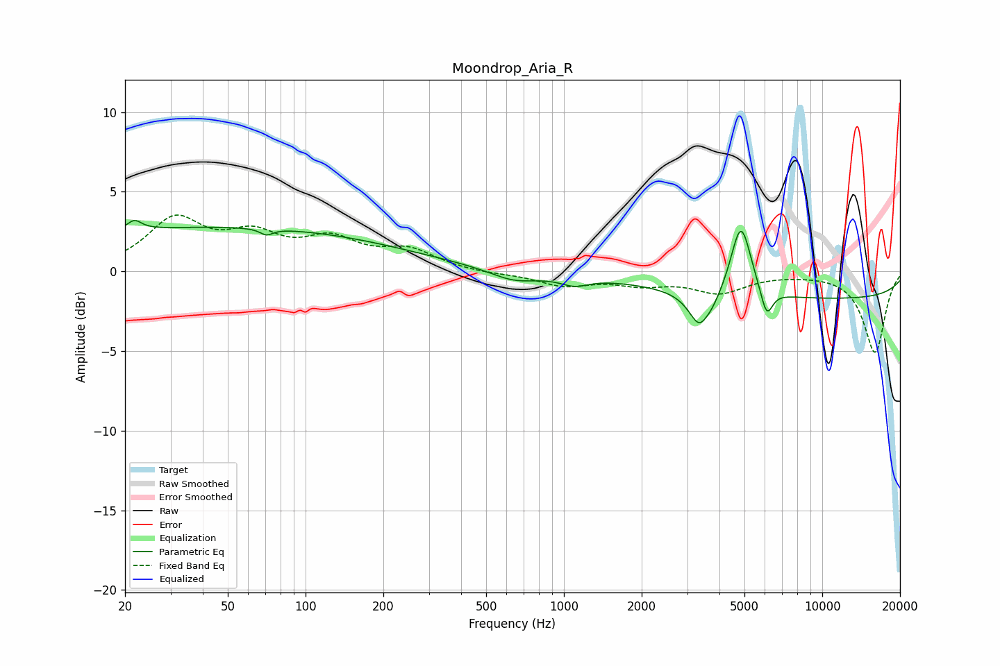

# Moondrop_Aria_R
See [usage instructions](https://github.com/jaakkopasanen/AutoEq#usage) for more options and info.

### Parametric EQs
Apply preamp of -3.3 dB when using parametric equalizer.

|   # | Type    |   Fc (Hz) |    Q |   Gain (dB) |
|-----|---------|-----------|------|-------------|
|   1 | Peaking |        22 | 5.03 |         0.6 |
|   2 | Peaking |        45 | 0.18 |         2.8 |
|   3 | Peaking |        71 | 5.87 |        -0.4 |
|   4 | Peaking |       641 | 1.49 |        -0.7 |
|   5 | Peaking |      1099 | 2.58 |        -0.5 |
|   6 | Peaking |      3447 | 3.24 |        -3.2 |
|   7 | Peaking |      3519 | 5.67 |         0.8 |
|   8 | Peaking |      4844 | 3.57 |         4.6 |
|   9 | Peaking |      6095 | 6    |        -1.8 |
|  10 | Peaking |     10000 | 0.18 |        -1.7 |

### Fixed Band EQs
When using fixed band (also called graphic) equalizer, apply preamp of **-3.6 dB** (if available) and set gains manually with these parameters.

|   # | Type    |   Fc (Hz) |    Q |   Gain (dB) |
|-----|---------|-----------|------|-------------|
|   1 | Peaking |        31 | 1.41 |         3.1 |
|   2 | Peaking |        62 | 1.41 |         1.9 |
|   3 | Peaking |       125 | 1.41 |         1.7 |
|   4 | Peaking |       250 | 1.41 |         1.2 |
|   5 | Peaking |       500 | 1.41 |        -0.1 |
|   6 | Peaking |      1000 | 1.41 |        -0.8 |
|   7 | Peaking |      2000 | 1.41 |        -0.7 |
|   8 | Peaking |      4000 | 1.41 |        -1.2 |
|   9 | Peaking |      8000 | 1.41 |        -0   |
|  10 | Peaking |     16000 | 1.41 |        -5.1 |

### Graphs

