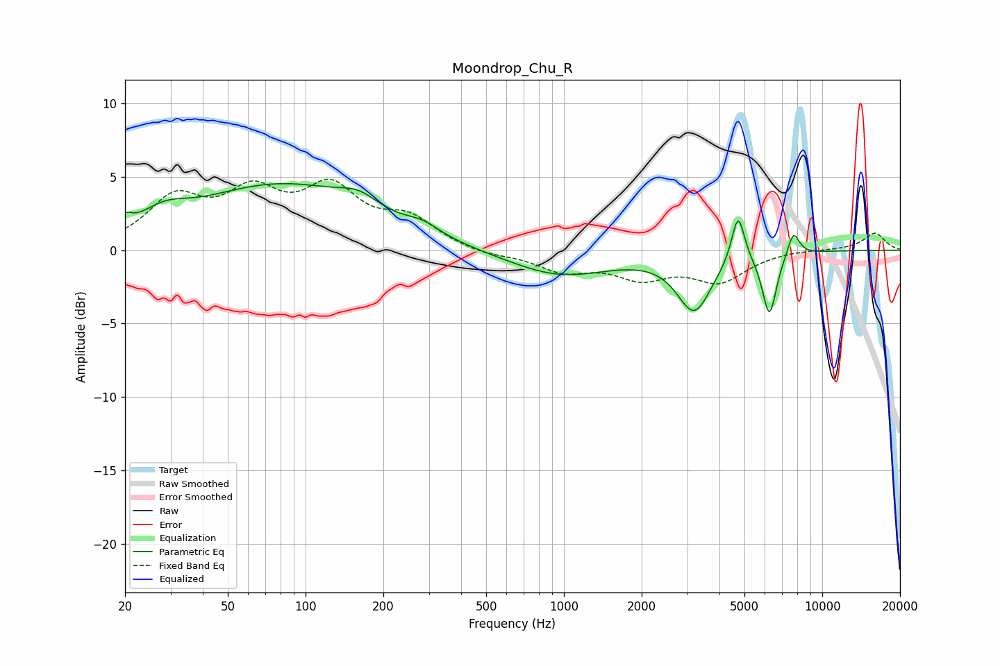

# Moondrop_Chu_R
See [usage instructions](https://github.com/jaakkopasanen/AutoEq#usage) for more options and info.

### Parametric EQs
Apply preamp of -4.6 dB when using parametric equalizer.

|   # | Type    |   Fc (Hz) |    Q |   Gain (dB) |
|-----|---------|-----------|------|-------------|
|   1 | Peaking |        20 | 5.6  |         0.7 |
|   2 | Peaking |        28 | 1.57 |         1.2 |
|   3 | Peaking |        81 | 0.41 |         4.4 |
|   4 | Peaking |       160 | 1.87 |         0.9 |
|   5 | Peaking |       285 | 2.27 |         0.6 |
|   6 | Peaking |       963 | 0.71 |        -1.8 |
|   7 | Peaking |      3194 | 2.15 |        -3.9 |
|   8 | Peaking |      4722 | 5.54 |         3.4 |
|   9 | Peaking |      6246 | 5.01 |        -4.3 |
|  10 | Peaking |      7737 | 5.81 |         1.7 |

### Fixed Band EQs
When using fixed band (also called graphic) equalizer, apply preamp of **-4.9 dB** (if available) and set gains manually with these parameters.

|   # | Type    |   Fc (Hz) |    Q |   Gain (dB) |
|-----|---------|-----------|------|-------------|
|   1 | Peaking |        31 | 1.41 |         3.2 |
|   2 | Peaking |        62 | 1.41 |         3.4 |
|   3 | Peaking |       125 | 1.41 |         3.8 |
|   4 | Peaking |       250 | 1.41 |         1.9 |
|   5 | Peaking |       500 | 1.41 |        -0.4 |
|   6 | Peaking |      1000 | 1.41 |        -1.3 |
|   7 | Peaking |      2000 | 1.41 |        -1.6 |
|   8 | Peaking |      4000 | 1.41 |        -2   |
|   9 | Peaking |      8000 | 1.41 |         0.1 |
|  10 | Peaking |     16000 | 1.41 |         1.2 |

### Graphs

