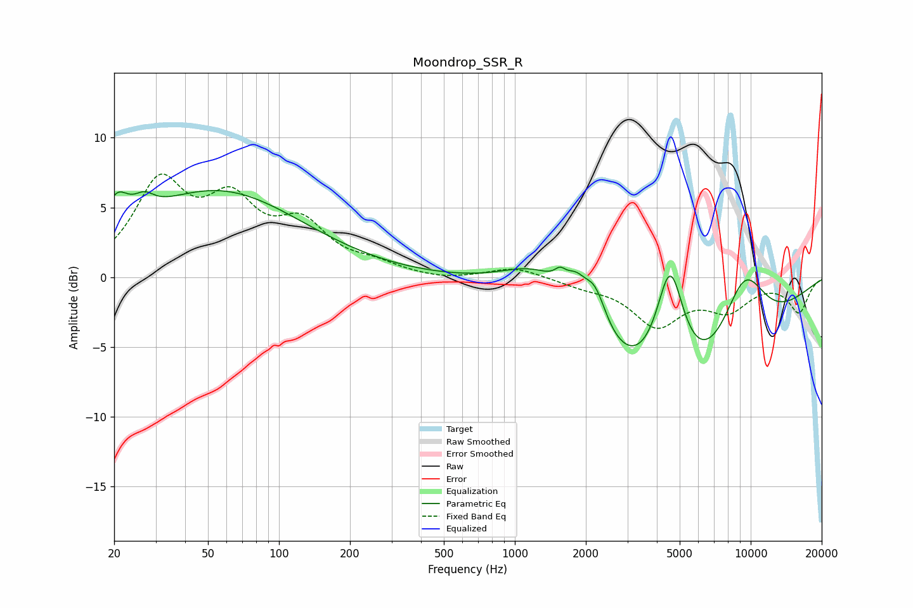

# Moondrop_SSR_R
See [usage instructions](https://github.com/jaakkopasanen/AutoEq#usage) for more options and info.

### Parametric EQs
Apply preamp of -6.3 dB when using parametric equalizer.

|   # | Type    |   Fc (Hz) |    Q |   Gain (dB) |
|-----|---------|-----------|------|-------------|
|   1 | Peaking |        20 | 2.9  |         2.4 |
|   2 | Peaking |        27 | 3.38 |         1   |
|   3 | Peaking |        55 | 0.39 |         6.1 |
|   4 | Peaking |      1277 | 0.9  |         3.4 |
|   5 | Peaking |      1557 | 5.73 |         0.8 |
|   6 | Peaking |      1813 | 3.2  |         1.7 |
|   7 | Peaking |      2189 | 2.83 |         3   |
|   8 | Peaking |      4553 | 2.21 |         8.8 |
|   9 | Peaking |      4829 | 0.36 |       -10.2 |
|  10 | Peaking |      9344 | 1.23 |         6.2 |

### Fixed Band EQs
When using fixed band (also called graphic) equalizer, apply preamp of **-7.5 dB** (if available) and set gains manually with these parameters.

|   # | Type    |   Fc (Hz) |    Q |   Gain (dB) |
|-----|---------|-----------|------|-------------|
|   1 | Peaking |        31 | 1.41 |         6.4 |
|   2 | Peaking |        62 | 1.41 |         4.6 |
|   3 | Peaking |       125 | 1.41 |         3.3 |
|   4 | Peaking |       250 | 1.41 |         0.7 |
|   5 | Peaking |       500 | 1.41 |        -0.2 |
|   6 | Peaking |      1000 | 1.41 |         0.7 |
|   7 | Peaking |      2000 | 1.41 |        -0.5 |
|   8 | Peaking |      4000 | 1.41 |        -3.3 |
|   9 | Peaking |      8000 | 1.41 |        -2.1 |
|  10 | Peaking |     16000 | 1.41 |        -2.4 |

### Graphs

