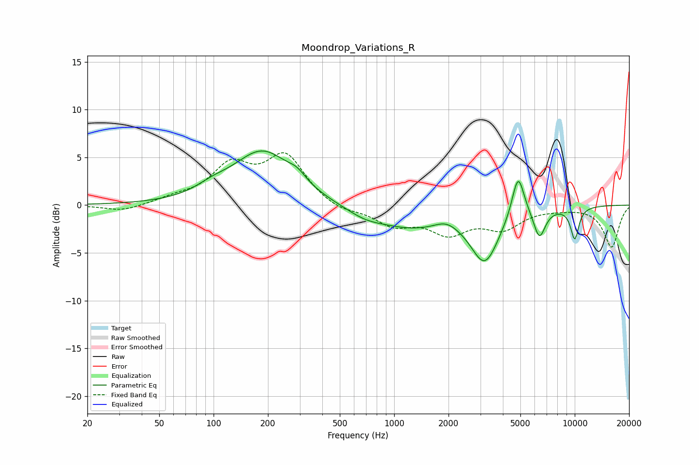

# Moondrop_Variations_R
See [usage instructions](https://github.com/jaakkopasanen/AutoEq#usage) for more options and info.

### Parametric EQs
Apply preamp of -5.8 dB when using parametric equalizer.

|   # | Type    |   Fc (Hz) |    Q |   Gain (dB) |
|-----|---------|-----------|------|-------------|
|   1 | Peaking |        98 | 1.58 |         0.7 |
|   2 | Peaking |       187 | 0.86 |         5.6 |
|   3 | Peaking |       290 | 2.91 |         0.9 |
|   4 | Peaking |       684 | 1.47 |        -0.7 |
|   5 | Peaking |      1257 | 0.62 |        -2.3 |
|   6 | Peaking |      1941 | 2.12 |         0.9 |
|   7 | Peaking |      3178 | 1.81 |        -5.4 |
|   8 | Peaking |      4857 | 4.09 |         4.7 |
|   9 | Peaking |      6374 | 4.22 |        -3   |
|  10 | Peaking |     10000 | 5.21 |        -3.3 |

### Fixed Band EQs
When using fixed band (also called graphic) equalizer, apply preamp of **-5.6 dB** (if available) and set gains manually with these parameters.

|   # | Type    |   Fc (Hz) |    Q |   Gain (dB) |
|-----|---------|-----------|------|-------------|
|   1 | Peaking |        31 | 1.41 |        -0.7 |
|   2 | Peaking |        62 | 1.41 |         0.6 |
|   3 | Peaking |       125 | 1.41 |         3.8 |
|   4 | Peaking |       250 | 1.41 |         5   |
|   5 | Peaking |       500 | 1.41 |        -0.8 |
|   6 | Peaking |      1000 | 1.41 |        -1.9 |
|   7 | Peaking |      2000 | 1.41 |        -2.6 |
|   8 | Peaking |      4000 | 1.41 |        -2.2 |
|   9 | Peaking |      8000 | 1.41 |        -0.2 |
|  10 | Peaking |     16000 | 1.41 |        -4.4 |

### Graphs

