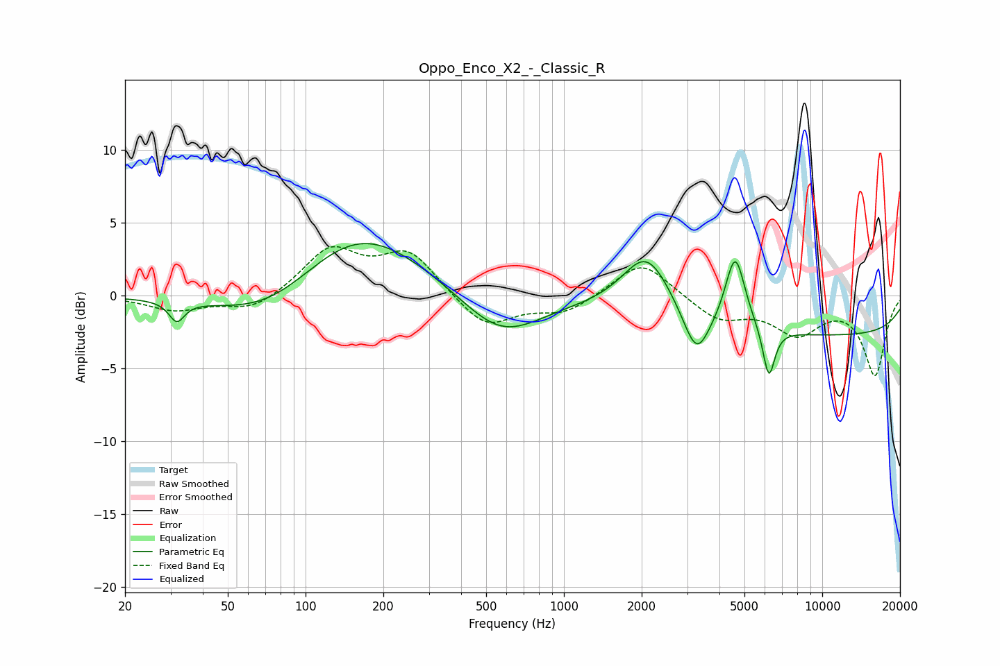

# Oppo_Enco_X2_-_Classic_R
See [usage instructions](https://github.com/jaakkopasanen/AutoEq#usage) for more options and info.

### Parametric EQs
Apply preamp of -3.7 dB when using parametric equalizer.

|   # | Type    |   Fc (Hz) |    Q |   Gain (dB) |
|-----|---------|-----------|------|-------------|
|   1 | Peaking |        32 | 4.84 |        -1.4 |
|   2 | Peaking |        75 | 0.66 |        -2.7 |
|   3 | Peaking |       156 | 0.55 |         5.1 |
|   4 | Peaking |       570 | 0.91 |        -3.1 |
|   5 | Peaking |      2087 | 1.43 |         3.2 |
|   6 | Peaking |      2105 | 1.77 |         1   |
|   7 | Peaking |      3261 | 2.8  |        -3.2 |
|   8 | Peaking |      4604 | 3.64 |         5.1 |
|   9 | Peaking |      6213 | 5.92 |        -3.5 |
|  10 | Peaking |     10000 | 0.18 |        -2.7 |

### Fixed Band EQs
When using fixed band (also called graphic) equalizer, apply preamp of **-3.5 dB** (if available) and set gains manually with these parameters.

|   # | Type    |   Fc (Hz) |    Q |   Gain (dB) |
|-----|---------|-----------|------|-------------|
|   1 | Peaking |        31 | 1.41 |        -1   |
|   2 | Peaking |        62 | 1.41 |        -1.1 |
|   3 | Peaking |       125 | 1.41 |         3.1 |
|   4 | Peaking |       250 | 1.41 |         2.9 |
|   5 | Peaking |       500 | 1.41 |        -2.3 |
|   6 | Peaking |      1000 | 1.41 |        -1.2 |
|   7 | Peaking |      2000 | 1.41 |         2.5 |
|   8 | Peaking |      4000 | 1.41 |        -1.6 |
|   9 | Peaking |      8000 | 1.41 |        -2.4 |
|  10 | Peaking |     16000 | 1.41 |        -5.4 |

### Graphs

