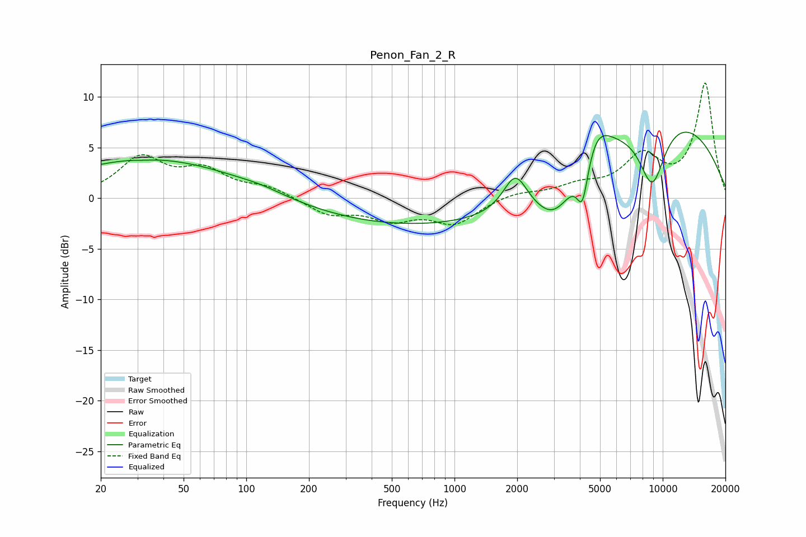

# Penon_Fan_2_R
See [usage instructions](https://github.com/jaakkopasanen/AutoEq#usage) for more options and info.

### Parametric EQs
Apply preamp of -6.6 dB when using parametric equalizer.

|   # | Type    |   Fc (Hz) |    Q |   Gain (dB) |
|-----|---------|-----------|------|-------------|
|   1 | Peaking |        32 | 4.29 |        -0.1 |
|   2 | Peaking |        35 | 0.34 |         3.9 |
|   3 | Peaking |       118 | 1.36 |         0.3 |
|   4 | Peaking |       949 | 0.19 |        -3   |
|   5 | Peaking |      1960 | 2.49 |         3.6 |
|   6 | Peaking |      3034 | 1.48 |        -3.6 |
|   7 | Peaking |      4121 | 5.12 |        -4.3 |
|   8 | Peaking |      4778 | 1.93 |         3.3 |
|   9 | Peaking |      8899 | 1.99 |        -6.5 |
|  10 | Peaking |      9484 | 0.31 |         8.6 |

### Fixed Band EQs
When using fixed band (also called graphic) equalizer, apply preamp of **-11.5 dB** (if available) and set gains manually with these parameters.

|   # | Type    |   Fc (Hz) |    Q |   Gain (dB) |
|-----|---------|-----------|------|-------------|
|   1 | Peaking |        31 | 1.41 |         3.8 |
|   2 | Peaking |        62 | 1.41 |         2.4 |
|   3 | Peaking |       125 | 1.41 |         1   |
|   4 | Peaking |       250 | 1.41 |        -1.5 |
|   5 | Peaking |       500 | 1.41 |        -1.9 |
|   6 | Peaking |      1000 | 1.41 |        -2.4 |
|   7 | Peaking |      2000 | 1.41 |         0.6 |
|   8 | Peaking |      4000 | 1.41 |         1.1 |
|   9 | Peaking |      8000 | 1.41 |         3.9 |
|  10 | Peaking |     16000 | 1.41 |        11.2 |

### Graphs

