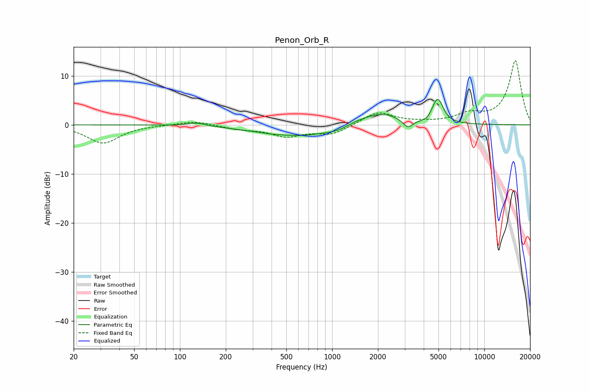

# Penon_Orb_R
See [usage instructions](https://github.com/jaakkopasanen/AutoEq#usage) for more options and info.

### Parametric EQs
Apply preamp of -5.2 dB when using parametric equalizer.

|   # | Type    |   Fc (Hz) |    Q |   Gain (dB) |
|-----|---------|-----------|------|-------------|
|   1 | Peaking |       129 | 2.39 |         0.7 |
|   2 | Peaking |       394 | 2.03 |        -0.1 |
|   3 | Peaking |       613 | 0.52 |        -2.3 |
|   4 | Peaking |      1079 | 1.8  |        -0.5 |
|   5 | Peaking |      1443 | 3.03 |         0.3 |
|   6 | Peaking |      2052 | 1.02 |         2.8 |
|   7 | Peaking |      3145 | 4.18 |        -1.9 |
|   8 | Peaking |      4185 | 5.01 |        -0.4 |
|   9 | Peaking |      4704 | 5.96 |         0.9 |
|  10 | Peaking |      5001 | 4.09 |         4.3 |

### Fixed Band EQs
When using fixed band (also called graphic) equalizer, apply preamp of **-13.2 dB** (if available) and set gains manually with these parameters.

|   # | Type    |   Fc (Hz) |    Q |   Gain (dB) |
|-----|---------|-----------|------|-------------|
|   1 | Peaking |        31 | 1.41 |        -3.7 |
|   2 | Peaking |        62 | 1.41 |        -0   |
|   3 | Peaking |       125 | 1.41 |         0.8 |
|   4 | Peaking |       250 | 1.41 |        -0.8 |
|   5 | Peaking |       500 | 1.41 |        -2.2 |
|   6 | Peaking |      1000 | 1.41 |        -1.9 |
|   7 | Peaking |      2000 | 1.41 |         2.7 |
|   8 | Peaking |      4000 | 1.41 |         0.3 |
|   9 | Peaking |      8000 | 1.41 |         1.9 |
|  10 | Peaking |     16000 | 1.41 |        13.1 |

### Graphs

