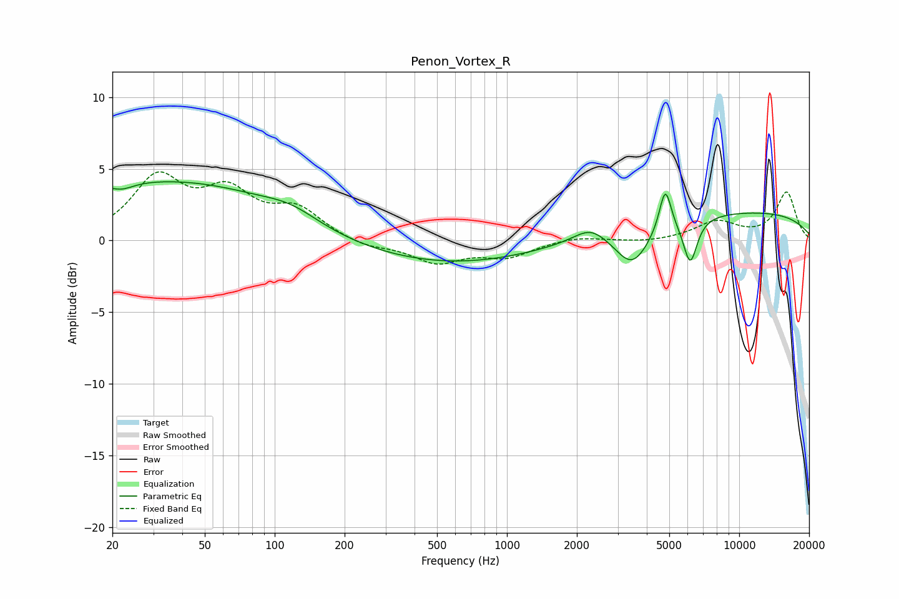

# Penon_Vortex_R
See [usage instructions](https://github.com/jaakkopasanen/AutoEq#usage) for more options and info.

### Parametric EQs
Apply preamp of -4.2 dB when using parametric equalizer.

|   # | Type    |   Fc (Hz) |    Q |   Gain (dB) |
|-----|---------|-----------|------|-------------|
|   1 | Peaking |        22 | 2.79 |        -0.5 |
|   2 | Peaking |        26 | 0.25 |         3.9 |
|   3 | Peaking |       118 | 1.2  |         0.8 |
|   4 | Peaking |       119 | 0.36 |         1.3 |
|   5 | Peaking |       362 | 0.26 |        -2.1 |
|   6 | Peaking |      2286 | 2.07 |         0.9 |
|   7 | Peaking |      3467 | 1.86 |        -2.8 |
|   8 | Peaking |      4805 | 5.49 |         3   |
|   9 | Peaking |      6155 | 4.63 |        -3.1 |
|  10 | Peaking |      9766 | 0.23 |         2   |

### Fixed Band EQs
When using fixed band (also called graphic) equalizer, apply preamp of **-4.9 dB** (if available) and set gains manually with these parameters.

|   # | Type    |   Fc (Hz) |    Q |   Gain (dB) |
|-----|---------|-----------|------|-------------|
|   1 | Peaking |        31 | 1.41 |         4.2 |
|   2 | Peaking |        62 | 1.41 |         3   |
|   3 | Peaking |       125 | 1.41 |         2   |
|   4 | Peaking |       250 | 1.41 |        -0.5 |
|   5 | Peaking |       500 | 1.41 |        -1.5 |
|   6 | Peaking |      1000 | 1.41 |        -1.1 |
|   7 | Peaking |      2000 | 1.41 |         0.3 |
|   8 | Peaking |      4000 | 1.41 |        -0.2 |
|   9 | Peaking |      8000 | 1.41 |         1.3 |
|  10 | Peaking |     16000 | 1.41 |         3.3 |

### Graphs

