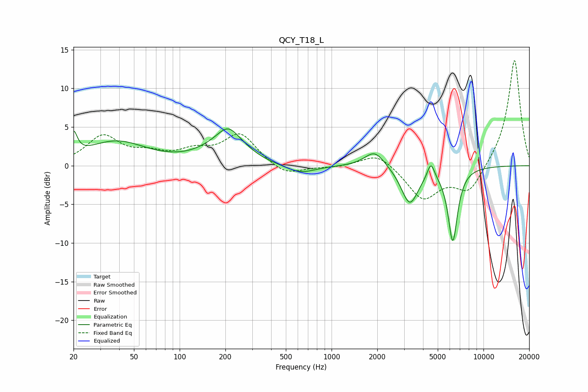

# QCY_T18_L
See [usage instructions](https://github.com/jaakkopasanen/AutoEq#usage) for more options and info.

### Parametric EQs
Apply preamp of -4.9 dB when using parametric equalizer.

|   # | Type    |   Fc (Hz) |    Q |   Gain (dB) |
|-----|---------|-----------|------|-------------|
|   1 | Peaking |        20 | 5.89 |         2.9 |
|   2 | Peaking |        38 | 0.71 |         3.1 |
|   3 | Peaking |       160 | 1.06 |         0.9 |
|   4 | Peaking |       217 | 1.61 |         4.7 |
|   5 | Peaking |       232 | 2.51 |        -0.9 |
|   6 | Peaking |       622 | 1.42 |        -1.1 |
|   7 | Peaking |      1924 | 2.14 |         2.1 |
|   8 | Peaking |      3272 | 2.49 |        -4.9 |
|   9 | Peaking |      4509 | 6    |         2.1 |
|  10 | Peaking |      6281 | 4.33 |        -9.6 |

### Fixed Band EQs
When using fixed band (also called graphic) equalizer, apply preamp of **-13.7 dB** (if available) and set gains manually with these parameters.

|   # | Type    |   Fc (Hz) |    Q |   Gain (dB) |
|-----|---------|-----------|------|-------------|
|   1 | Peaking |        31 | 1.41 |         3.7 |
|   2 | Peaking |        62 | 1.41 |         1.2 |
|   3 | Peaking |       125 | 1.41 |         1.6 |
|   4 | Peaking |       250 | 1.41 |         4   |
|   5 | Peaking |       500 | 1.41 |        -1.4 |
|   6 | Peaking |      1000 | 1.41 |        -0.2 |
|   7 | Peaking |      2000 | 1.41 |         1.8 |
|   8 | Peaking |      4000 | 1.41 |        -4.3 |
|   9 | Peaking |      8000 | 1.41 |        -3.5 |
|  10 | Peaking |     16000 | 1.41 |        13.9 |

### Graphs

