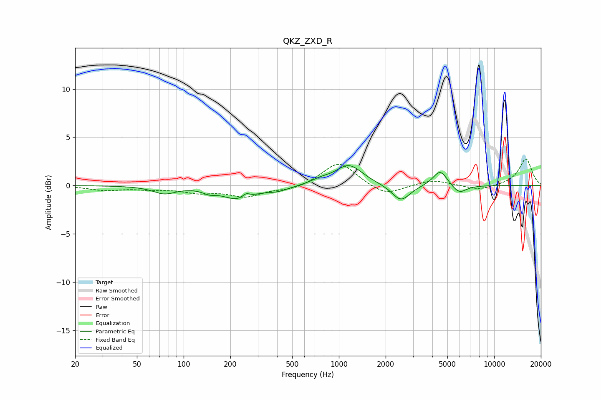

# QKZ_ZXD_R
See [usage instructions](https://github.com/jaakkopasanen/AutoEq#usage) for more options and info.

### Parametric EQs
Apply preamp of -2.2 dB when using parametric equalizer.

|   # | Type    |   Fc (Hz) |    Q |   Gain (dB) |
|-----|---------|-----------|------|-------------|
|   1 | Peaking |        75 | 1.95 |        -0.8 |
|   2 | Peaking |       146 | 3.51 |        -0.4 |
|   3 | Peaking |       224 | 1.44 |        -1.4 |
|   4 | Peaking |       252 | 6    |         0.5 |
|   5 | Peaking |       403 | 1.85 |        -0.5 |
|   6 | Peaking |       761 | 2.41 |         0.4 |
|   7 | Peaking |      1159 | 1.61 |         2.1 |
|   8 | Peaking |      2510 | 2.42 |        -1.7 |
|   9 | Peaking |      4490 | 3.07 |         1.7 |
|  10 | Peaking |      5949 | 2.99 |        -0.9 |

### Fixed Band EQs
When using fixed band (also called graphic) equalizer, apply preamp of **-2.8 dB** (if available) and set gains manually with these parameters.

|   # | Type    |   Fc (Hz) |    Q |   Gain (dB) |
|-----|---------|-----------|------|-------------|
|   1 | Peaking |        31 | 1.41 |        -0.4 |
|   2 | Peaking |        62 | 1.41 |        -0.3 |
|   3 | Peaking |       125 | 1.41 |        -0.6 |
|   4 | Peaking |       250 | 1.41 |        -1.1 |
|   5 | Peaking |       500 | 1.41 |        -0.5 |
|   6 | Peaking |      1000 | 1.41 |         2.5 |
|   7 | Peaking |      2000 | 1.41 |        -1.1 |
|   8 | Peaking |      4000 | 1.41 |         0.6 |
|   9 | Peaking |      8000 | 1.41 |        -0.5 |
|  10 | Peaking |     16000 | 1.41 |         2.8 |

### Graphs

