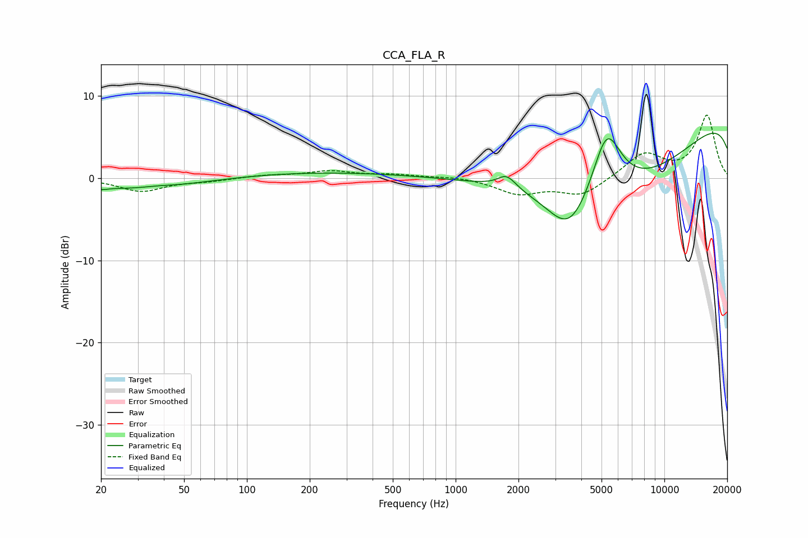

# CCA_FLA_R
See [usage instructions](https://github.com/jaakkopasanen/AutoEq#usage) for more options and info.

### Parametric EQs
Apply preamp of -5.5 dB when using parametric equalizer.

|   # | Type    |   Fc (Hz) |    Q |   Gain (dB) |
|-----|---------|-----------|------|-------------|
|   1 | Peaking |        20 | 5.7  |        -0.2 |
|   2 | Peaking |        29 | 0.42 |        -1.4 |
|   3 | Peaking |        37 | 2.23 |         0.1 |
|   4 | Peaking |       204 | 0.29 |         0.8 |
|   5 | Peaking |      1768 | 3.38 |         1.9 |
|   6 | Peaking |      1805 | 4.73 |        -0.3 |
|   7 | Peaking |      3521 | 1.29 |        -5.9 |
|   8 | Peaking |      5289 | 1.91 |         8.4 |
|   9 | Peaking |      6562 | 0.29 |       -12.8 |
|  10 | Peaking |     10000 | 0.18 |        12.7 |

### Fixed Band EQs
When using fixed band (also called graphic) equalizer, apply preamp of **-7.7 dB** (if available) and set gains manually with these parameters.

|   # | Type    |   Fc (Hz) |    Q |   Gain (dB) |
|-----|---------|-----------|------|-------------|
|   1 | Peaking |        31 | 1.41 |        -1.6 |
|   2 | Peaking |        62 | 1.41 |        -0.3 |
|   3 | Peaking |       125 | 1.41 |         0.3 |
|   4 | Peaking |       250 | 1.41 |         0.8 |
|   5 | Peaking |       500 | 1.41 |         0.4 |
|   6 | Peaking |      1000 | 1.41 |         0.2 |
|   7 | Peaking |      2000 | 1.41 |        -1.8 |
|   8 | Peaking |      4000 | 1.41 |        -2.1 |
|   9 | Peaking |      8000 | 1.41 |         3   |
|  10 | Peaking |     16000 | 1.41 |         7.6 |

### Graphs

