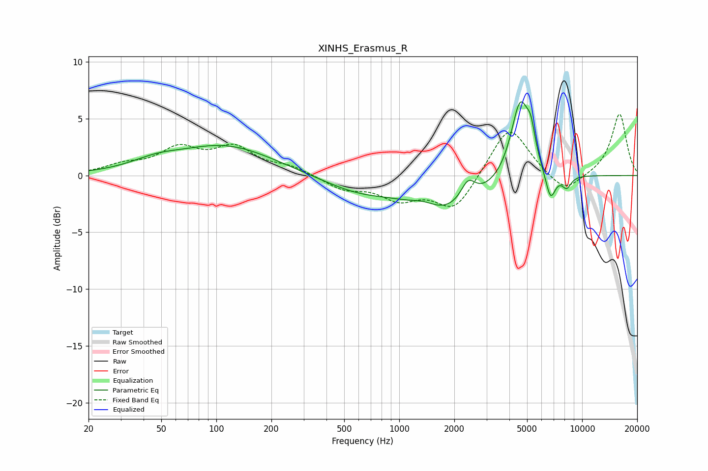

# XINHS_Erasmus_R
See [usage instructions](https://github.com/jaakkopasanen/AutoEq#usage) for more options and info.

### Parametric EQs
Apply preamp of -6.6 dB when using parametric equalizer.

|   # | Type    |   Fc (Hz) |    Q |   Gain (dB) |
|-----|---------|-----------|------|-------------|
|   1 | Peaking |        47 | 1.05 |         0.7 |
|   2 | Peaking |       112 | 0.54 |         2.6 |
|   3 | Peaking |       588 | 0.73 |        -1.2 |
|   4 | Peaking |      1363 | 2.14 |         0.5 |
|   5 | Peaking |      1829 | 0.7  |        -3.1 |
|   6 | Peaking |      2378 | 3.43 |         1.9 |
|   7 | Peaking |      4587 | 2.71 |         7   |
|   8 | Peaking |      5248 | 6    |         2   |
|   9 | Peaking |      6715 | 4.97 |        -2.5 |
|  10 | Peaking |      8231 | 5.14 |        -1.1 |

### Fixed Band EQs
When using fixed band (also called graphic) equalizer, apply preamp of **-5.5 dB** (if available) and set gains manually with these parameters.

|   # | Type    |   Fc (Hz) |    Q |   Gain (dB) |
|-----|---------|-----------|------|-------------|
|   1 | Peaking |        31 | 1.41 |         0.8 |
|   2 | Peaking |        62 | 1.41 |         2.2 |
|   3 | Peaking |       125 | 1.41 |         2.3 |
|   4 | Peaking |       250 | 1.41 |         0.7 |
|   5 | Peaking |       500 | 1.41 |        -1.1 |
|   6 | Peaking |      1000 | 1.41 |        -1.8 |
|   7 | Peaking |      2000 | 1.41 |        -3   |
|   8 | Peaking |      4000 | 1.41 |         4.6 |
|   9 | Peaking |      8000 | 1.41 |        -1.7 |
|  10 | Peaking |     16000 | 1.41 |         5.5 |

### Graphs

