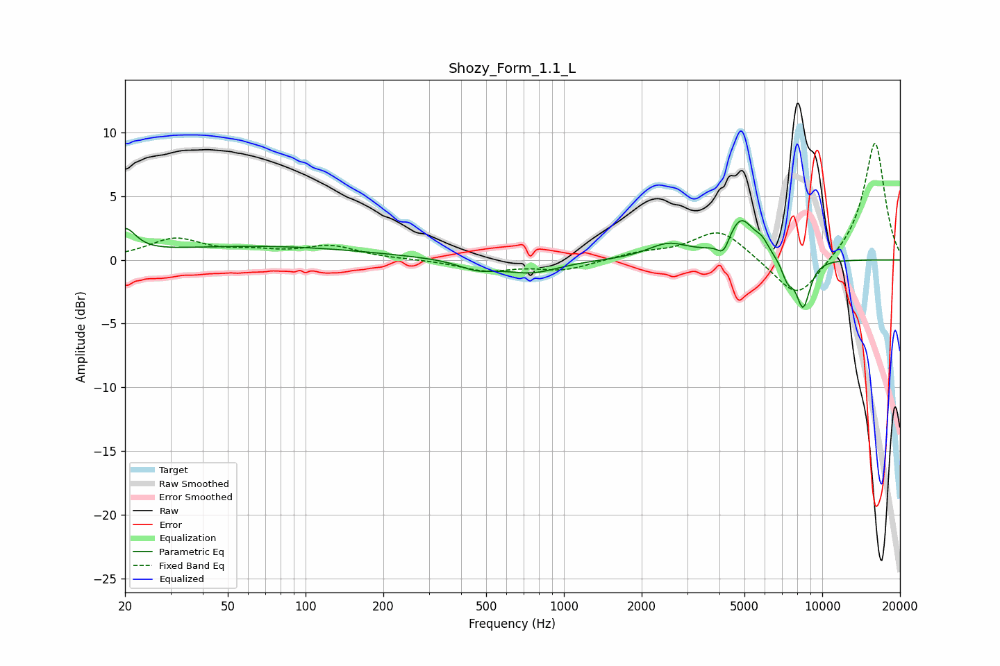

# Shozy_Form_1.1_L
See [usage instructions](https://github.com/jaakkopasanen/AutoEq#usage) for more options and info.

### Parametric EQs
Apply preamp of -3.2 dB when using parametric equalizer.

|   # | Type    |   Fc (Hz) |    Q |   Gain (dB) |
|-----|---------|-----------|------|-------------|
|   1 | Peaking |        20 | 3.5  |         1.9 |
|   2 | Peaking |        65 | 0.33 |         1.1 |
|   3 | Peaking |       461 | 2.01 |        -0.7 |
|   4 | Peaking |       747 | 1.34 |        -1   |
|   5 | Peaking |      2532 | 1.76 |         1.2 |
|   6 | Peaking |      4148 | 5.99 |        -1.2 |
|   7 | Peaking |      4837 | 2.6  |         3.2 |
|   8 | Peaking |      5850 | 5.25 |         0.7 |
|   9 | Peaking |      7340 | 5.84 |        -1.4 |
|  10 | Peaking |      8431 | 4.69 |        -3.7 |

### Fixed Band EQs
When using fixed band (also called graphic) equalizer, apply preamp of **-9.2 dB** (if available) and set gains manually with these parameters.

|   # | Type    |   Fc (Hz) |    Q |   Gain (dB) |
|-----|---------|-----------|------|-------------|
|   1 | Peaking |        31 | 1.41 |         1.6 |
|   2 | Peaking |        62 | 1.41 |         0.5 |
|   3 | Peaking |       125 | 1.41 |         1   |
|   4 | Peaking |       250 | 1.41 |         0   |
|   5 | Peaking |       500 | 1.41 |        -0.8 |
|   6 | Peaking |      1000 | 1.41 |        -0.8 |
|   7 | Peaking |      2000 | 1.41 |         0.5 |
|   8 | Peaking |      4000 | 1.41 |         2.4 |
|   9 | Peaking |      8000 | 1.41 |        -3.3 |
|  10 | Peaking |     16000 | 1.41 |         9.3 |

### Graphs

