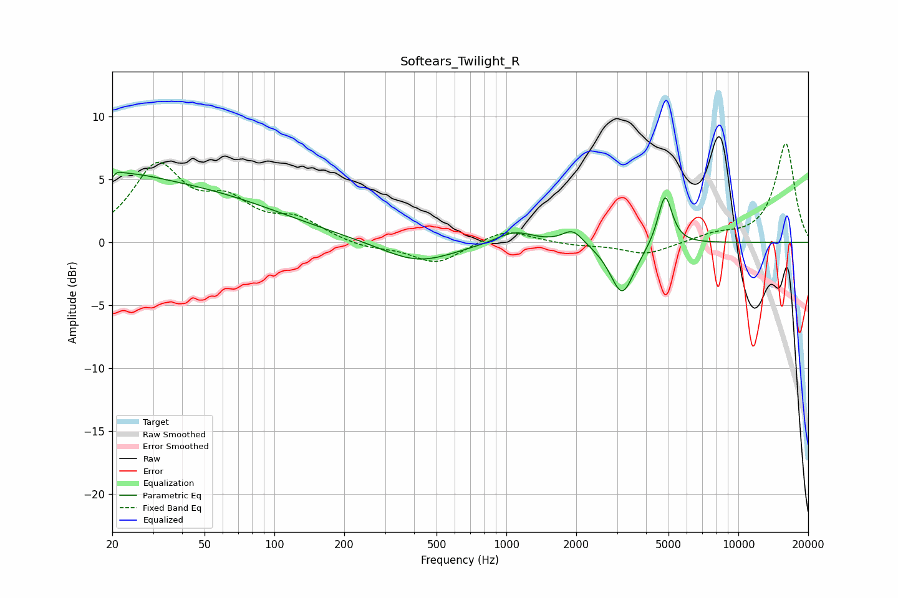

# Softears_Twilight_R
See [usage instructions](https://github.com/jaakkopasanen/AutoEq#usage) for more options and info.

### Parametric EQs
Apply preamp of -5.7 dB when using parametric equalizer.

|   # | Type    |   Fc (Hz) |    Q |   Gain (dB) |
|-----|---------|-----------|------|-------------|
|   1 | Peaking |        20 | 5.96 |        -3.4 |
|   2 | Peaking |        20 | 5.75 |         3.4 |
|   3 | Peaking |        22 | 1.03 |         1   |
|   4 | Peaking |        29 | 0.27 |         4.5 |
|   5 | Peaking |       415 | 0.91 |        -1.7 |
|   6 | Peaking |      1085 | 1.72 |         1   |
|   7 | Peaking |      1933 | 3.2  |         1.2 |
|   8 | Peaking |      3157 | 2.84 |        -3.5 |
|   9 | Peaking |      3182 | 1.97 |        -0.7 |
|  10 | Peaking |      4830 | 4.57 |         4.1 |

### Fixed Band EQs
When using fixed band (also called graphic) equalizer, apply preamp of **-7.9 dB** (if available) and set gains manually with these parameters.

|   # | Type    |   Fc (Hz) |    Q |   Gain (dB) |
|-----|---------|-----------|------|-------------|
|   1 | Peaking |        31 | 1.41 |         5.8 |
|   2 | Peaking |        62 | 1.41 |         2.7 |
|   3 | Peaking |       125 | 1.41 |         1.6 |
|   4 | Peaking |       250 | 1.41 |        -0.5 |
|   5 | Peaking |       500 | 1.41 |        -1.7 |
|   6 | Peaking |      1000 | 1.41 |         1.1 |
|   7 | Peaking |      2000 | 1.41 |        -0.2 |
|   8 | Peaking |      4000 | 1.41 |        -1   |
|   9 | Peaking |      8000 | 1.41 |         0.6 |
|  10 | Peaking |     16000 | 1.41 |         7.9 |

### Graphs

