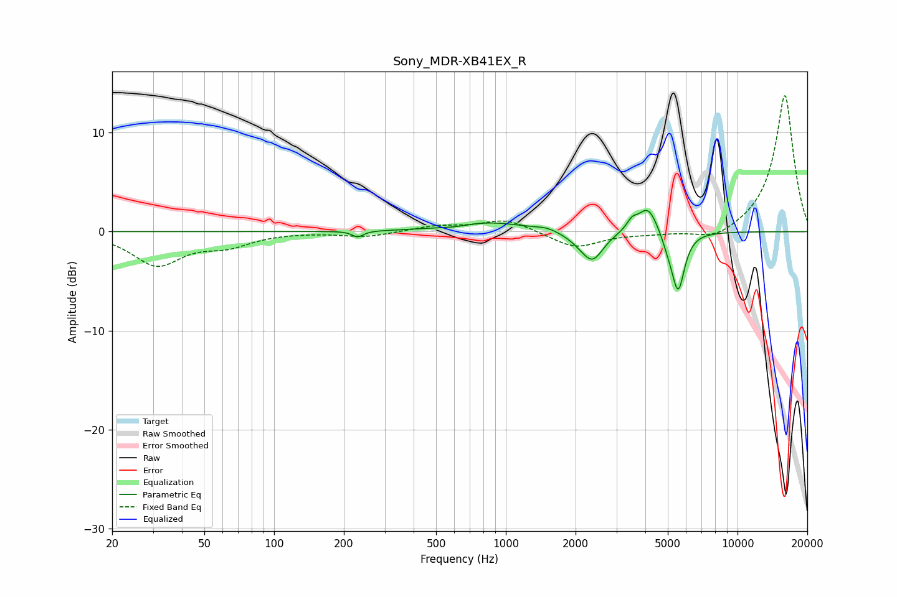

# Sony_MDR-XB41EX_R
See [usage instructions](https://github.com/jaakkopasanen/AutoEq#usage) for more options and info.

### Parametric EQs
Apply preamp of -2.2 dB when using parametric equalizer.

|   # | Type    |   Fc (Hz) |    Q |   Gain (dB) |
|-----|---------|-----------|------|-------------|
|   1 | Peaking |       229 | 6    |        -0.6 |
|   2 | Peaking |       600 | 2.27 |        -0.2 |
|   3 | Peaking |       837 | 0.88 |         1   |
|   4 | Peaking |      1499 | 3.04 |         0.3 |
|   5 | Peaking |      2088 | 2.56 |        -0.6 |
|   6 | Peaking |      2371 | 3.03 |        -2.7 |
|   7 | Peaking |      3506 | 6    |         0.9 |
|   8 | Peaking |      4114 | 3.28 |         2.8 |
|   9 | Peaking |      5033 | 4.74 |        -1.1 |
|  10 | Peaking |      5547 | 5.09 |        -5.8 |

### Fixed Band EQs
When using fixed band (also called graphic) equalizer, apply preamp of **-13.8 dB** (if available) and set gains manually with these parameters.

|   # | Type    |   Fc (Hz) |    Q |   Gain (dB) |
|-----|---------|-----------|------|-------------|
|   1 | Peaking |        31 | 1.41 |        -3.3 |
|   2 | Peaking |        62 | 1.41 |        -1.2 |
|   3 | Peaking |       125 | 1.41 |         0   |
|   4 | Peaking |       250 | 1.41 |        -0.5 |
|   5 | Peaking |       500 | 1.41 |         0.5 |
|   6 | Peaking |      1000 | 1.41 |         1.3 |
|   7 | Peaking |      2000 | 1.41 |        -1.7 |
|   8 | Peaking |      4000 | 1.41 |        -0.2 |
|   9 | Peaking |      8000 | 1.41 |        -1.1 |
|  10 | Peaking |     16000 | 1.41 |        13.9 |

### Graphs

