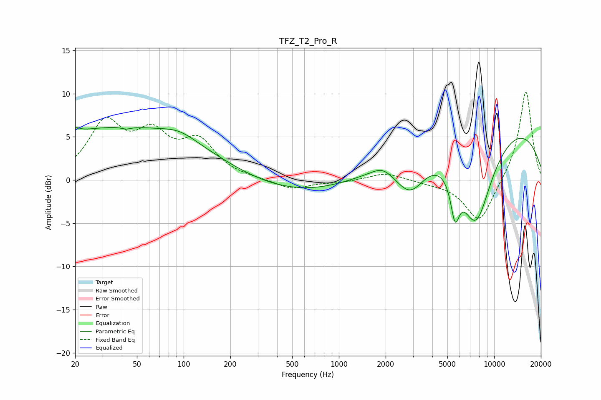

# TFZ_T2_Pro_R
See [usage instructions](https://github.com/jaakkopasanen/AutoEq#usage) for more options and info.

### Parametric EQs
Apply preamp of -6.2 dB when using parametric equalizer.

|   # | Type    |   Fc (Hz) |    Q |   Gain (dB) |
|-----|---------|-----------|------|-------------|
|   1 | Peaking |        20 | 5.74 |         0.5 |
|   2 | Peaking |        42 | 0.2  |         6.2 |
|   3 | Peaking |        43 | 5.19 |        -0.3 |
|   4 | Peaking |        94 | 1.36 |         0.9 |
|   5 | Peaking |       540 | 0.25 |        -2.2 |
|   6 | Peaking |      1907 | 2.27 |         0.8 |
|   7 | Peaking |      2879 | 1.37 |        -4.7 |
|   8 | Peaking |      5597 | 4.91 |        -4.4 |
|   9 | Peaking |      7601 | 1.13 |       -11.6 |
|  10 | Peaking |      8214 | 0.2  |         7.9 |

### Fixed Band EQs
When using fixed band (also called graphic) equalizer, apply preamp of **-10.3 dB** (if available) and set gains manually with these parameters.

|   # | Type    |   Fc (Hz) |    Q |   Gain (dB) |
|-----|---------|-----------|------|-------------|
|   1 | Peaking |        31 | 1.41 |         6.2 |
|   2 | Peaking |        62 | 1.41 |         4.5 |
|   3 | Peaking |       125 | 1.41 |         4.1 |
|   4 | Peaking |       250 | 1.41 |         0.1 |
|   5 | Peaking |       500 | 1.41 |        -1.1 |
|   6 | Peaking |      1000 | 1.41 |        -0.3 |
|   7 | Peaking |      2000 | 1.41 |         0.9 |
|   8 | Peaking |      4000 | 1.41 |        -0.2 |
|   9 | Peaking |      8000 | 1.41 |        -5   |
|  10 | Peaking |     16000 | 1.41 |        10.5 |

### Graphs

