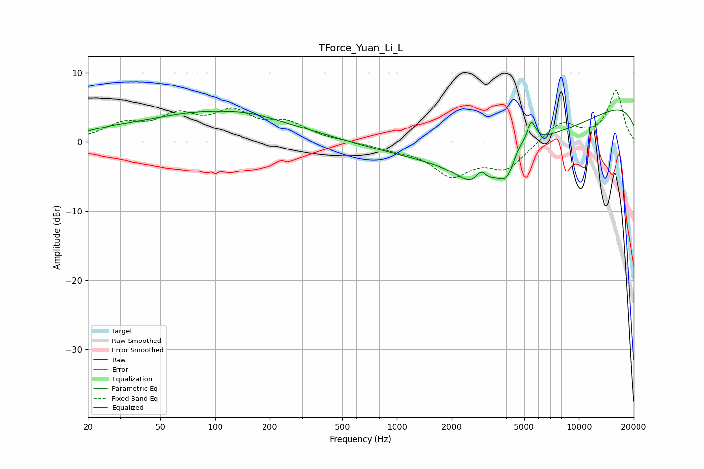

# TForce_Yuan_Li_L
See [usage instructions](https://github.com/jaakkopasanen/AutoEq#usage) for more options and info.

### Parametric EQs
Apply preamp of -4.7 dB when using parametric equalizer.

|   # | Type    |   Fc (Hz) |    Q |   Gain (dB) |
|-----|---------|-----------|------|-------------|
|   1 | Peaking |        26 | 1.16 |         0.5 |
|   2 | Peaking |       100 | 0.34 |         4.3 |
|   3 | Peaking |       159 | 1.29 |         0.3 |
|   4 | Peaking |      2791 | 1.24 |        -4.9 |
|   5 | Peaking |      2894 | 4.85 |         1.9 |
|   6 | Peaking |      4090 | 2.83 |        -3.9 |
|   7 | Peaking |      4380 | 0.24 |        -6.2 |
|   8 | Peaking |      4610 | 3.06 |         2.1 |
|   9 | Peaking |      5489 | 5.97 |         3.2 |
|  10 | Peaking |     10000 | 0.18 |         7.5 |

### Fixed Band EQs
When using fixed band (also called graphic) equalizer, apply preamp of **-7.6 dB** (if available) and set gains manually with these parameters.

|   # | Type    |   Fc (Hz) |    Q |   Gain (dB) |
|-----|---------|-----------|------|-------------|
|   1 | Peaking |        31 | 1.41 |         2.3 |
|   2 | Peaking |        62 | 1.41 |         3.3 |
|   3 | Peaking |       125 | 1.41 |         3.8 |
|   4 | Peaking |       250 | 1.41 |         2.4 |
|   5 | Peaking |       500 | 1.41 |         0   |
|   6 | Peaking |      1000 | 1.41 |        -0.9 |
|   7 | Peaking |      2000 | 1.41 |        -4.5 |
|   8 | Peaking |      4000 | 1.41 |        -3.6 |
|   9 | Peaking |      8000 | 1.41 |         3   |
|  10 | Peaking |     16000 | 1.41 |         7.4 |

### Graphs

