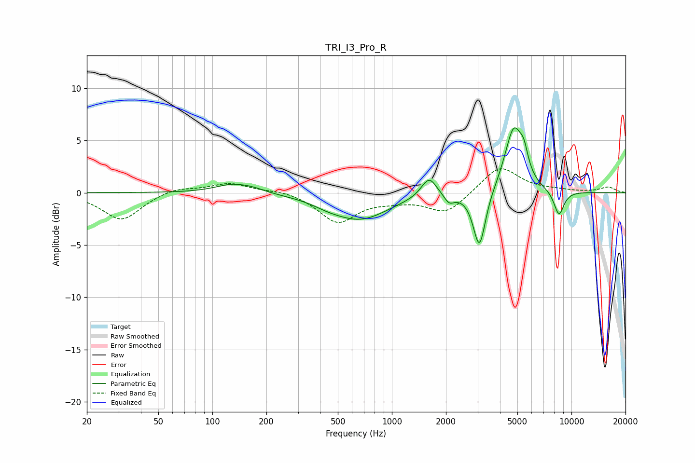

# TRI_I3_Pro_R
See [usage instructions](https://github.com/jaakkopasanen/AutoEq#usage) for more options and info.

### Parametric EQs
Apply preamp of -6.3 dB when using parametric equalizer.

|   # | Type    |   Fc (Hz) |    Q |   Gain (dB) |
|-----|---------|-----------|------|-------------|
|   1 | Peaking |       130 | 1.45 |         0.8 |
|   2 | Peaking |       170 | 2.12 |         0.3 |
|   3 | Peaking |       438 | 1.71 |        -0.3 |
|   4 | Peaking |       665 | 0.89 |        -2.5 |
|   5 | Peaking |      1611 | 3.27 |         1.9 |
|   6 | Peaking |      2083 | 4.89 |        -0.9 |
|   7 | Peaking |      3072 | 4.1  |        -5.5 |
|   8 | Peaking |      4772 | 2.74 |         6.2 |
|   9 | Peaking |      5434 | 6    |         1.6 |
|  10 | Peaking |      8518 | 4.59 |        -2.4 |

### Fixed Band EQs
When using fixed band (also called graphic) equalizer, apply preamp of **-2.4 dB** (if available) and set gains manually with these parameters.

|   # | Type    |   Fc (Hz) |    Q |   Gain (dB) |
|-----|---------|-----------|------|-------------|
|   1 | Peaking |        31 | 1.41 |        -2.6 |
|   2 | Peaking |        62 | 1.41 |         0.5 |
|   3 | Peaking |       125 | 1.41 |         0.9 |
|   4 | Peaking |       250 | 1.41 |         0.3 |
|   5 | Peaking |       500 | 1.41 |        -2.8 |
|   6 | Peaking |      1000 | 1.41 |        -0.5 |
|   7 | Peaking |      2000 | 1.41 |        -2   |
|   8 | Peaking |      4000 | 1.41 |         2.6 |
|   9 | Peaking |      8000 | 1.41 |         0.2 |
|  10 | Peaking |     16000 | 1.41 |         0.5 |

### Graphs

