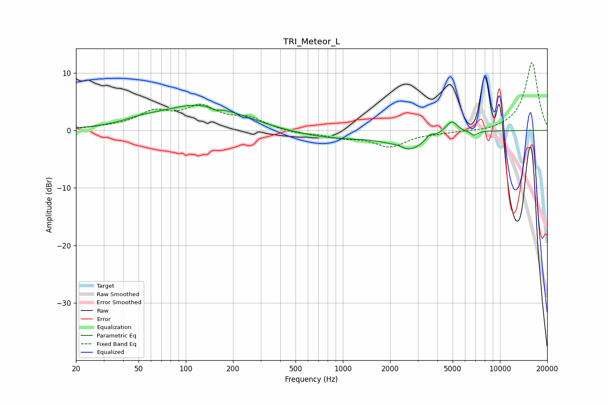

# TRI_Meteor_L
See [usage instructions](https://github.com/jaakkopasanen/AutoEq#usage) for more options and info.

### Parametric EQs
Apply preamp of -4.5 dB when using parametric equalizer.

|   # | Type    |   Fc (Hz) |    Q |   Gain (dB) |
|-----|---------|-----------|------|-------------|
|   1 | Peaking |        52 | 1.38 |         0.6 |
|   2 | Peaking |       124 | 0.54 |         4.5 |
|   3 | Peaking |       154 | 4.46 |        -0.6 |
|   4 | Peaking |       854 | 0.51 |        -1.4 |
|   5 | Peaking |      2264 | 2.91 |         0.7 |
|   6 | Peaking |      2589 | 1.37 |        -3.3 |
|   7 | Peaking |      3575 | 6    |         0.8 |
|   8 | Peaking |      4987 | 3.25 |         2.7 |
|   9 | Peaking |      5364 | 3.26 |        -0.6 |
|  10 | Peaking |      6837 | 6    |        -0.8 |

### Fixed Band EQs
When using fixed band (also called graphic) equalizer, apply preamp of **-11.9 dB** (if available) and set gains manually with these parameters.

|   # | Type    |   Fc (Hz) |    Q |   Gain (dB) |
|-----|---------|-----------|------|-------------|
|   1 | Peaking |        31 | 1.41 |         0.3 |
|   2 | Peaking |        62 | 1.41 |         2.9 |
|   3 | Peaking |       125 | 1.41 |         3.7 |
|   4 | Peaking |       250 | 1.41 |         1.9 |
|   5 | Peaking |       500 | 1.41 |        -0.6 |
|   6 | Peaking |      1000 | 1.41 |        -1   |
|   7 | Peaking |      2000 | 1.41 |        -2.7 |
|   8 | Peaking |      4000 | 1.41 |        -0.3 |
|   9 | Peaking |      8000 | 1.41 |        -0.3 |
|  10 | Peaking |     16000 | 1.41 |        11.9 |

### Graphs

