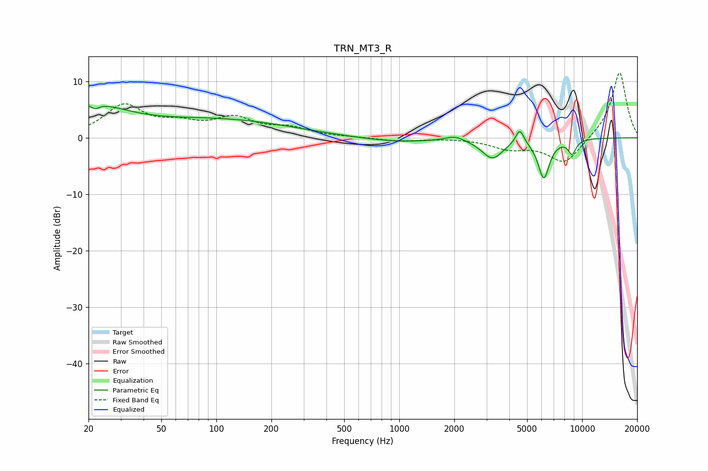

# TRN_MT3_R
See [usage instructions](https://github.com/jaakkopasanen/AutoEq#usage) for more options and info.

### Parametric EQs
Apply preamp of -5.7 dB when using parametric equalizer.

|   # | Type    |   Fc (Hz) |    Q |   Gain (dB) |
|-----|---------|-----------|------|-------------|
|   1 | Peaking |        20 | 0.7  |         5.4 |
|   2 | Peaking |        21 | 5.82 |         3.3 |
|   3 | Peaking |        22 | 5.92 |        -4.2 |
|   4 | Peaking |       108 | 0.36 |         3   |
|   5 | Peaking |       974 | 0.66 |        -0.8 |
|   6 | Peaking |      2012 | 2.64 |         0.9 |
|   7 | Peaking |      3231 | 2.42 |        -3.5 |
|   8 | Peaking |      4563 | 6    |         2.7 |
|   9 | Peaking |      6170 | 4.36 |        -6.9 |
|  10 | Peaking |      8818 | 6    |        -2.5 |

### Fixed Band EQs
When using fixed band (also called graphic) equalizer, apply preamp of **-11.6 dB** (if available) and set gains manually with these parameters.

|   # | Type    |   Fc (Hz) |    Q |   Gain (dB) |
|-----|---------|-----------|------|-------------|
|   1 | Peaking |        31 | 1.41 |         5.5 |
|   2 | Peaking |        62 | 1.41 |         1.9 |
|   3 | Peaking |       125 | 1.41 |         3.1 |
|   4 | Peaking |       250 | 1.41 |         1.5 |
|   5 | Peaking |       500 | 1.41 |         0.1 |
|   6 | Peaking |      1000 | 1.41 |        -0.6 |
|   7 | Peaking |      2000 | 1.41 |         0   |
|   8 | Peaking |      4000 | 1.41 |        -1.7 |
|   9 | Peaking |      8000 | 1.41 |        -4.6 |
|  10 | Peaking |     16000 | 1.41 |        11.8 |

### Graphs

