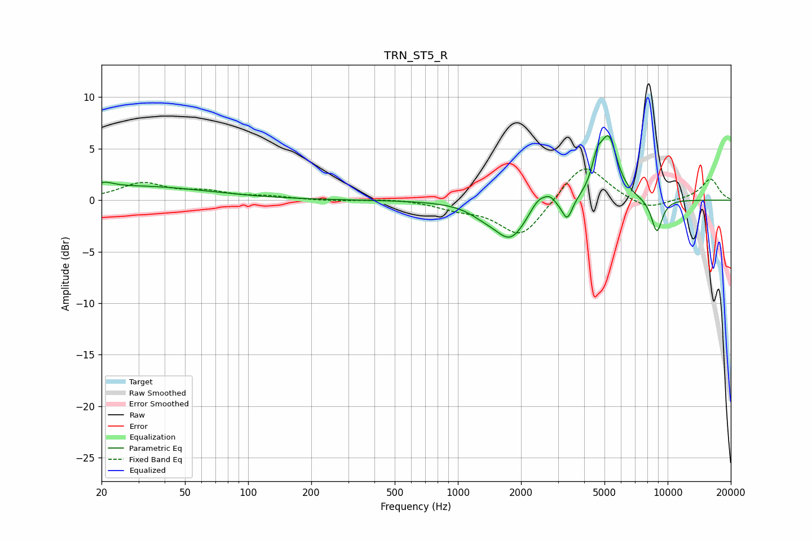

# TRN_ST5_R
See [usage instructions](https://github.com/jaakkopasanen/AutoEq#usage) for more options and info.

### Parametric EQs
Apply preamp of -6.4 dB when using parametric equalizer.

|   # | Type    |   Fc (Hz) |    Q |   Gain (dB) |
|-----|---------|-----------|------|-------------|
|   1 | Peaking |        21 | 3.26 |         0.5 |
|   2 | Peaking |        30 | 0.42 |         1.3 |
|   3 | Peaking |      1318 | 2.04 |        -0.7 |
|   4 | Peaking |      1783 | 1.85 |        -3.6 |
|   5 | Peaking |      2425 | 3.42 |         1.3 |
|   6 | Peaking |      2739 | 5.68 |         0.6 |
|   7 | Peaking |      3319 | 5.68 |        -2.1 |
|   8 | Peaking |      4605 | 5.59 |         2.3 |
|   9 | Peaking |      5236 | 3.33 |         5.8 |
|  10 | Peaking |      8884 | 4.81 |        -3.3 |

### Fixed Band EQs
When using fixed band (also called graphic) equalizer, apply preamp of **-3.1 dB** (if available) and set gains manually with these parameters.

|   # | Type    |   Fc (Hz) |    Q |   Gain (dB) |
|-----|---------|-----------|------|-------------|
|   1 | Peaking |        31 | 1.41 |         1.6 |
|   2 | Peaking |        62 | 1.41 |         0.7 |
|   3 | Peaking |       125 | 1.41 |         0.3 |
|   4 | Peaking |       250 | 1.41 |        -0.1 |
|   5 | Peaking |       500 | 1.41 |         0.2 |
|   6 | Peaking |      1000 | 1.41 |        -0.7 |
|   7 | Peaking |      2000 | 1.41 |        -3.7 |
|   8 | Peaking |      4000 | 1.41 |         3.8 |
|   9 | Peaking |      8000 | 1.41 |        -1   |
|  10 | Peaking |     16000 | 1.41 |         2.1 |

### Graphs

