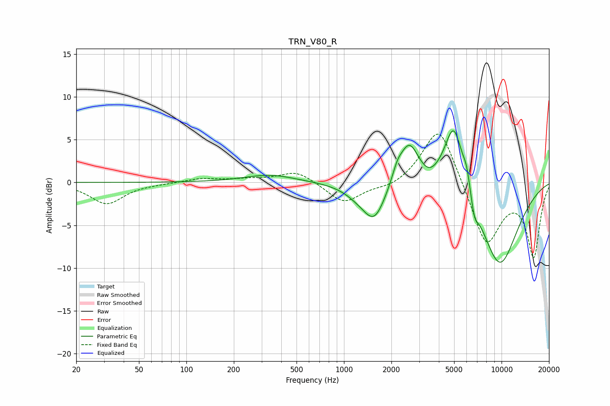

# TRN_V80_R
See [usage instructions](https://github.com/jaakkopasanen/AutoEq#usage) for more options and info.

### Parametric EQs
Apply preamp of -6.1 dB when using parametric equalizer.

|   # | Type    |   Fc (Hz) |    Q |   Gain (dB) |
|-----|---------|-----------|------|-------------|
|   1 | Peaking |       337 | 0.88 |         0.9 |
|   2 | Peaking |      1258 | 1.5  |        -1   |
|   3 | Peaking |      1564 | 1.98 |        -4   |
|   4 | Peaking |      2179 | 4.35 |         1.3 |
|   5 | Peaking |      2593 | 2.28 |         4.8 |
|   6 | Peaking |      3458 | 2.88 |        -0.6 |
|   7 | Peaking |      4982 | 2.19 |         8.4 |
|   8 | Peaking |      6001 | 5.94 |         1.8 |
|   9 | Peaking |      6731 | 6    |        -1.9 |
|  10 | Peaking |      9686 | 0.96 |        -9.9 |

### Fixed Band EQs
When using fixed band (also called graphic) equalizer, apply preamp of **-5.7 dB** (if available) and set gains manually with these parameters.

|   # | Type    |   Fc (Hz) |    Q |   Gain (dB) |
|-----|---------|-----------|------|-------------|
|   1 | Peaking |        31 | 1.41 |        -2.5 |
|   2 | Peaking |        62 | 1.41 |        -0.1 |
|   3 | Peaking |       125 | 1.41 |         0.5 |
|   4 | Peaking |       250 | 1.41 |         0.3 |
|   5 | Peaking |       500 | 1.41 |         1.4 |
|   6 | Peaking |      1000 | 1.41 |        -2.4 |
|   7 | Peaking |      2000 | 1.41 |        -0.7 |
|   8 | Peaking |      4000 | 1.41 |         7   |
|   9 | Peaking |      8000 | 1.41 |        -7.5 |
|  10 | Peaking |     16000 | 1.41 |        -8.5 |

### Graphs

