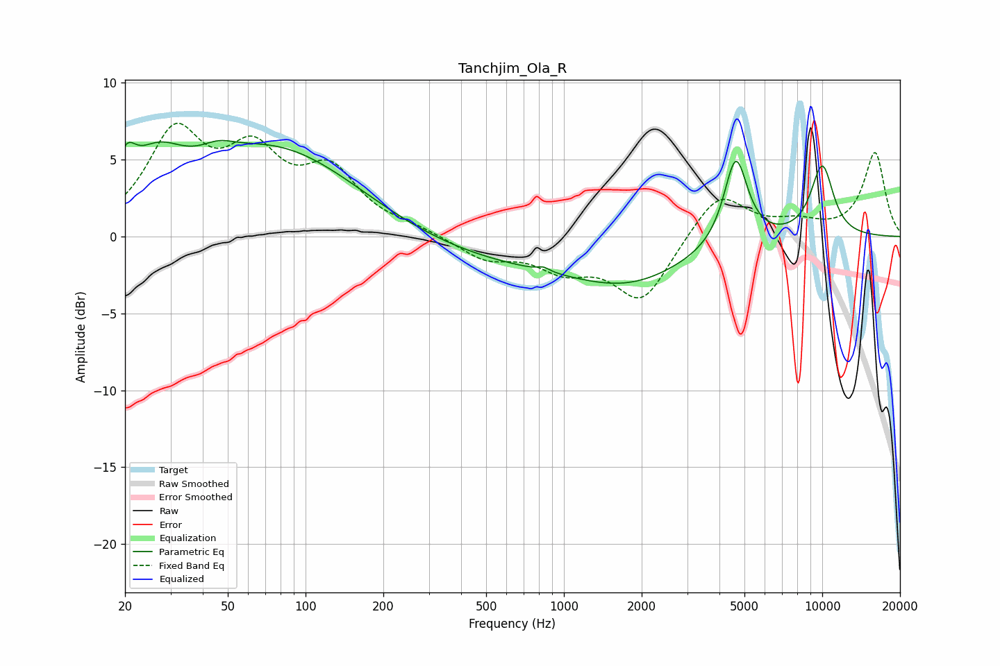

# Tanchjim_Ola_R
See [usage instructions](https://github.com/jaakkopasanen/AutoEq#usage) for more options and info.

### Parametric EQs
Apply preamp of -6.3 dB when using parametric equalizer.

|   # | Type    |   Fc (Hz) |    Q |   Gain (dB) |
|-----|---------|-----------|------|-------------|
|   1 | Peaking |        20 | 3.98 |         2.2 |
|   2 | Peaking |        26 | 1.45 |         2.7 |
|   3 | Peaking |        46 | 2.33 |         0.6 |
|   4 | Peaking |        79 | 0.4  |         7.3 |
|   5 | Peaking |       247 | 0.18 |        -2.1 |
|   6 | Peaking |       833 | 5.98 |         0.3 |
|   7 | Peaking |      1830 | 0.63 |        -2.4 |
|   8 | Peaking |      4627 | 3.08 |         5.7 |
|   9 | Peaking |     10000 | 2.59 |         3   |
|  10 | Peaking |     10000 | 2.88 |         1.6 |

### Fixed Band EQs
When using fixed band (also called graphic) equalizer, apply preamp of **-7.5 dB** (if available) and set gains manually with these parameters.

|   # | Type    |   Fc (Hz) |    Q |   Gain (dB) |
|-----|---------|-----------|------|-------------|
|   1 | Peaking |        31 | 1.41 |         6.3 |
|   2 | Peaking |        62 | 1.41 |         4.6 |
|   3 | Peaking |       125 | 1.41 |         3.8 |
|   4 | Peaking |       250 | 1.41 |         0.4 |
|   5 | Peaking |       500 | 1.41 |        -1.4 |
|   6 | Peaking |      1000 | 1.41 |        -1.8 |
|   7 | Peaking |      2000 | 1.41 |        -4.1 |
|   8 | Peaking |      4000 | 1.41 |         3   |
|   9 | Peaking |      8000 | 1.41 |         0.7 |
|  10 | Peaking |     16000 | 1.41 |         5.4 |

### Graphs

