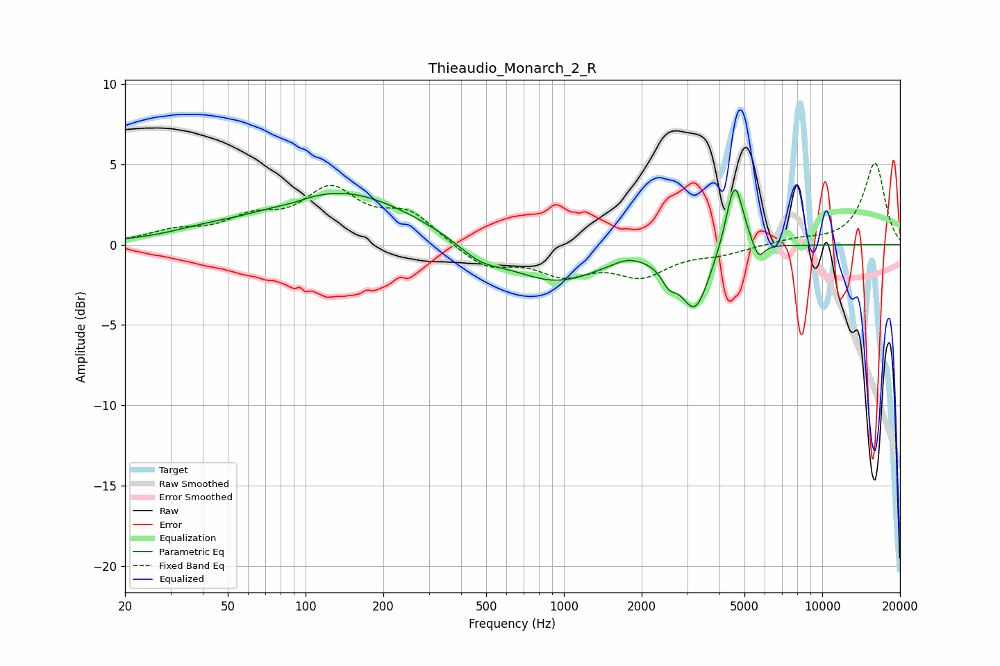

# Thieaudio_Monarch_2_R
See [usage instructions](https://github.com/jaakkopasanen/AutoEq#usage) for more options and info.

### Parametric EQs
Apply preamp of -3.5 dB when using parametric equalizer.

|   # | Type    |   Fc (Hz) |    Q |   Gain (dB) |
|-----|---------|-----------|------|-------------|
|   1 | Peaking |        39 | 1.13 |         0.3 |
|   2 | Peaking |        88 | 2.08 |        -0.2 |
|   3 | Peaking |       136 | 0.49 |         3.3 |
|   4 | Peaking |       472 | 1.64 |        -0.9 |
|   5 | Peaking |       918 | 0.77 |        -2.3 |
|   6 | Peaking |      1763 | 2.62 |         0.4 |
|   7 | Peaking |      2549 | 4.95 |        -1   |
|   8 | Peaking |      3220 | 2.53 |        -3.8 |
|   9 | Peaking |      4578 | 4.12 |         4.5 |
|  10 | Peaking |      5662 | 5.77 |        -1.1 |

### Fixed Band EQs
When using fixed band (also called graphic) equalizer, apply preamp of **-5.2 dB** (if available) and set gains manually with these parameters.

|   # | Type    |   Fc (Hz) |    Q |   Gain (dB) |
|-----|---------|-----------|------|-------------|
|   1 | Peaking |        31 | 1.41 |         0.7 |
|   2 | Peaking |        62 | 1.41 |         1.3 |
|   3 | Peaking |       125 | 1.41 |         3.1 |
|   4 | Peaking |       250 | 1.41 |         1.8 |
|   5 | Peaking |       500 | 1.41 |        -1.4 |
|   6 | Peaking |      1000 | 1.41 |        -1.6 |
|   7 | Peaking |      2000 | 1.41 |        -1.7 |
|   8 | Peaking |      4000 | 1.41 |        -0.5 |
|   9 | Peaking |      8000 | 1.41 |         0.3 |
|  10 | Peaking |     16000 | 1.41 |         5.1 |

### Graphs

