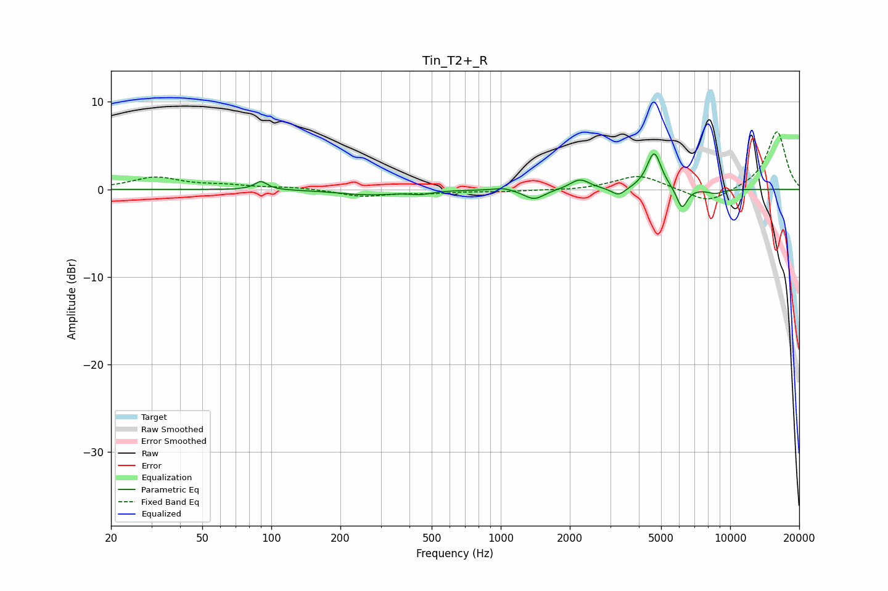

# Tin_T2+_R
See [usage instructions](https://github.com/jaakkopasanen/AutoEq#usage) for more options and info.

### Parametric EQs
Apply preamp of -4.2 dB when using parametric equalizer.

|   # | Type    |   Fc (Hz) |    Q |   Gain (dB) |
|-----|---------|-----------|------|-------------|
|   1 | Peaking |        90 | 5.19 |         1   |
|   2 | Peaking |       266 | 1.04 |        -0.6 |
|   3 | Peaking |       449 | 3.1  |        -0.3 |
|   4 | Peaking |      1027 | 3.63 |         0.3 |
|   5 | Peaking |      1399 | 3.16 |        -1.2 |
|   6 | Peaking |      2213 | 3.4  |         1.2 |
|   7 | Peaking |      3265 | 4.6  |        -0.9 |
|   8 | Peaking |      4664 | 4.48 |         4.3 |
|   9 | Peaking |      6168 | 6    |        -2.4 |
|  10 | Peaking |      8599 | 3.91 |        -0.5 |

### Fixed Band EQs
When using fixed band (also called graphic) equalizer, apply preamp of **-6.7 dB** (if available) and set gains manually with these parameters.

|   # | Type    |   Fc (Hz) |    Q |   Gain (dB) |
|-----|---------|-----------|------|-------------|
|   1 | Peaking |        31 | 1.41 |         1.3 |
|   2 | Peaking |        62 | 1.41 |         0.4 |
|   3 | Peaking |       125 | 1.41 |         0.2 |
|   4 | Peaking |       250 | 1.41 |        -0.8 |
|   5 | Peaking |       500 | 1.41 |        -0.3 |
|   6 | Peaking |      1000 | 1.41 |        -0.2 |
|   7 | Peaking |      2000 | 1.41 |        -0.1 |
|   8 | Peaking |      4000 | 1.41 |         1.7 |
|   9 | Peaking |      8000 | 1.41 |        -1.7 |
|  10 | Peaking |     16000 | 1.41 |         6.7 |

### Graphs

