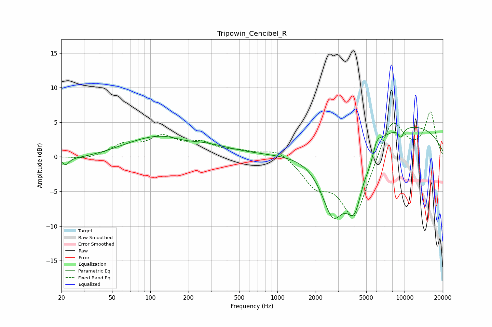

# Tripowin_Cencibel_R
See [usage instructions](https://github.com/jaakkopasanen/AutoEq#usage) for more options and info.

### Parametric EQs
Apply preamp of -4.4 dB when using parametric equalizer.

|   # | Type    |   Fc (Hz) |    Q |   Gain (dB) |
|-----|---------|-----------|------|-------------|
|   1 | Peaking |        22 | 5.96 |        -0.9 |
|   2 | Peaking |        26 | 0.43 |        -0.6 |
|   3 | Peaking |       136 | 0.44 |         3.5 |
|   4 | Peaking |       185 | 1.29 |        -0.8 |
|   5 | Peaking |      2738 | 1.42 |        -9.8 |
|   6 | Peaking |      4045 | 2.06 |        -7.9 |
|   7 | Peaking |      5401 | 3.37 |        -1.6 |
|   8 | Peaking |      6013 | 4.05 |         1.7 |
|   9 | Peaking |      8619 | 0.23 |         4.9 |
|  10 | Peaking |      9368 | 6    |        -1.3 |

### Fixed Band EQs
When using fixed band (also called graphic) equalizer, apply preamp of **-6.6 dB** (if available) and set gains manually with these parameters.

|   # | Type    |   Fc (Hz) |    Q |   Gain (dB) |
|-----|---------|-----------|------|-------------|
|   1 | Peaking |        31 | 1.41 |        -0.4 |
|   2 | Peaking |        62 | 1.41 |         1.6 |
|   3 | Peaking |       125 | 1.41 |         2.6 |
|   4 | Peaking |       250 | 1.41 |         1.7 |
|   5 | Peaking |       500 | 1.41 |         0.6 |
|   6 | Peaking |      1000 | 1.41 |         1.3 |
|   7 | Peaking |      2000 | 1.41 |        -3.6 |
|   8 | Peaking |      4000 | 1.41 |        -8.9 |
|   9 | Peaking |      8000 | 1.41 |         5.9 |
|  10 | Peaking |     16000 | 1.41 |         6.3 |

### Graphs

