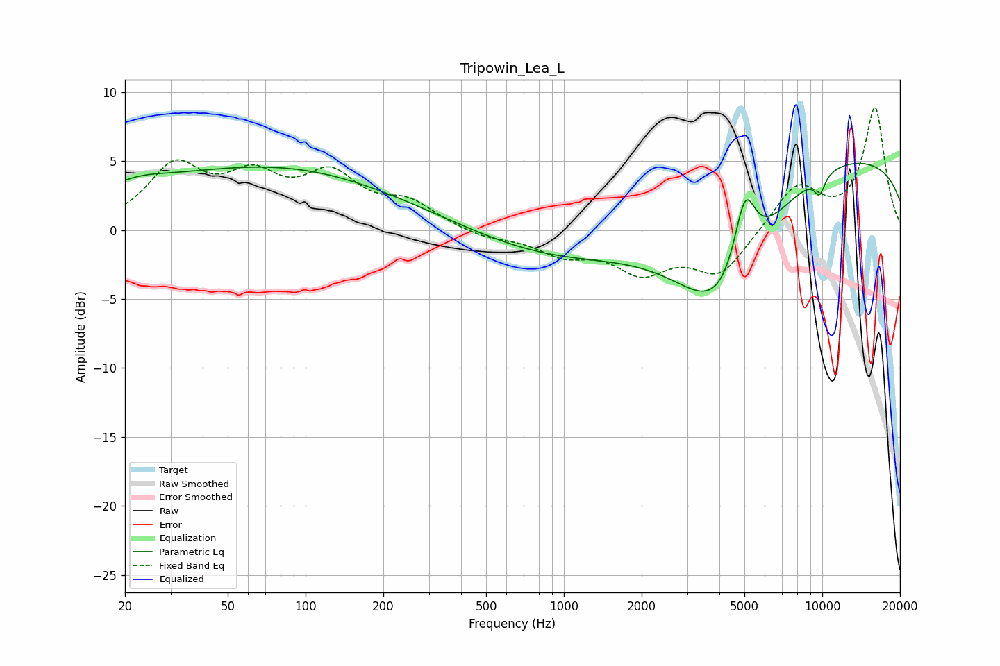

# Tripowin_Lea_L
See [usage instructions](https://github.com/jaakkopasanen/AutoEq#usage) for more options and info.

### Parametric EQs
Apply preamp of -4.9 dB when using parametric equalizer.

|   # | Type    |   Fc (Hz) |    Q |   Gain (dB) |
|-----|---------|-----------|------|-------------|
|   1 | Peaking |        23 | 1.58 |         0.4 |
|   2 | Peaking |        43 | 0.25 |         3.6 |
|   3 | Peaking |       196 | 0.27 |         1.8 |
|   4 | Peaking |      1599 | 0.26 |        -4   |
|   5 | Peaking |      4093 | 0.83 |        -7.2 |
|   6 | Peaking |      5021 | 3.24 |         5.4 |
|   7 | Peaking |      6304 | 0.21 |         0.3 |
|   8 | Peaking |      8756 | 0.27 |        -7.9 |
|   9 | Peaking |      9032 | 0.22 |        13.8 |
|  10 | Peaking |      9771 | 5.93 |        -1.4 |

### Fixed Band EQs
When using fixed band (also called graphic) equalizer, apply preamp of **-9.0 dB** (if available) and set gains manually with these parameters.

|   # | Type    |   Fc (Hz) |    Q |   Gain (dB) |
|-----|---------|-----------|------|-------------|
|   1 | Peaking |        31 | 1.41 |         4.3 |
|   2 | Peaking |        62 | 1.41 |         3.2 |
|   3 | Peaking |       125 | 1.41 |         3.6 |
|   4 | Peaking |       250 | 1.41 |         1.7 |
|   5 | Peaking |       500 | 1.41 |        -0.6 |
|   6 | Peaking |      1000 | 1.41 |        -1.5 |
|   7 | Peaking |      2000 | 1.41 |        -2.7 |
|   8 | Peaking |      4000 | 1.41 |        -3.1 |
|   9 | Peaking |      8000 | 1.41 |         3.3 |
|  10 | Peaking |     16000 | 1.41 |         8.8 |

### Graphs

