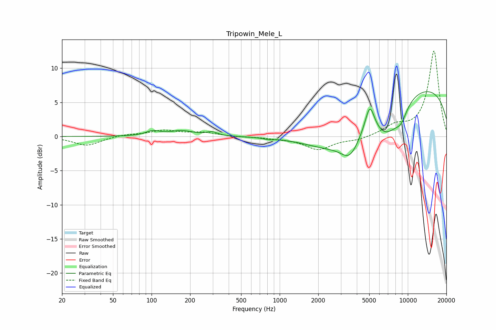

# Tripowin_Mele_L
See [usage instructions](https://github.com/jaakkopasanen/AutoEq#usage) for more options and info.

### Parametric EQs
Apply preamp of -6.7 dB when using parametric equalizer.

|   # | Type    |   Fc (Hz) |    Q |   Gain (dB) |
|-----|---------|-----------|------|-------------|
|   1 | Peaking |       102 | 2.64 |         0.7 |
|   2 | Peaking |       172 | 1.55 |         0.8 |
|   3 | Peaking |       295 | 3.39 |         0.5 |
|   4 | Peaking |       816 | 4.34 |        -0.2 |
|   5 | Peaking |      2593 | 0.59 |        -5.1 |
|   6 | Peaking |      3549 | 1.85 |        -3.5 |
|   7 | Peaking |      5055 | 3.84 |         3.9 |
|   8 | Peaking |      6812 | 1.23 |        -4.8 |
|   9 | Peaking |      8849 | 2.51 |        -2.1 |
|  10 | Peaking |      9714 | 0.18 |         7.8 |

### Fixed Band EQs
When using fixed band (also called graphic) equalizer, apply preamp of **-12.6 dB** (if available) and set gains manually with these parameters.

|   # | Type    |   Fc (Hz) |    Q |   Gain (dB) |
|-----|---------|-----------|------|-------------|
|   1 | Peaking |        31 | 1.41 |        -1.3 |
|   2 | Peaking |        62 | 1.41 |         0.3 |
|   3 | Peaking |       125 | 1.41 |         0.8 |
|   4 | Peaking |       250 | 1.41 |         0.5 |
|   5 | Peaking |       500 | 1.41 |        -0.1 |
|   6 | Peaking |      1000 | 1.41 |        -0.2 |
|   7 | Peaking |      2000 | 1.41 |        -1.9 |
|   8 | Peaking |      4000 | 1.41 |        -0.5 |
|   9 | Peaking |      8000 | 1.41 |         1.4 |
|  10 | Peaking |     16000 | 1.41 |        12.6 |

### Graphs

