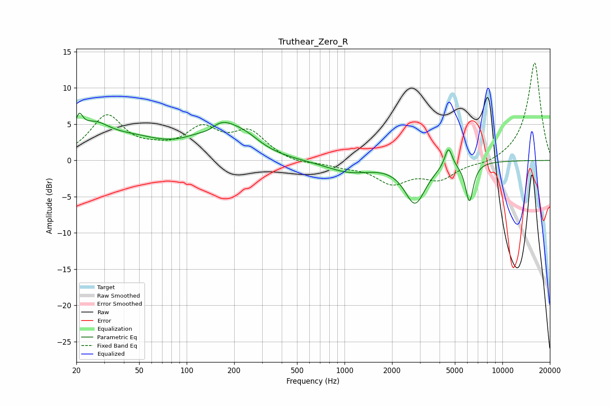

# Truthear_Zero_R
See [usage instructions](https://github.com/jaakkopasanen/AutoEq#usage) for more options and info.

### Parametric EQs
Apply preamp of -6.6 dB when using parametric equalizer.

|   # | Type    |   Fc (Hz) |    Q |   Gain (dB) |
|-----|---------|-----------|------|-------------|
|   1 | Peaking |        21 | 5.9  |         2.8 |
|   2 | Peaking |        26 | 1.31 |         3.8 |
|   3 | Peaking |        47 | 0.78 |         2.2 |
|   4 | Peaking |       139 | 2.21 |        -1.5 |
|   5 | Peaking |       156 | 1.08 |         5.3 |
|   6 | Peaking |       239 | 1.44 |         1.4 |
|   7 | Peaking |      1074 | 0.95 |        -1.5 |
|   8 | Peaking |      2796 | 2.14 |        -5.7 |
|   9 | Peaking |      4552 | 5.88 |         2.9 |
|  10 | Peaking |      6180 | 5.54 |        -5.4 |

### Fixed Band EQs
When using fixed band (also called graphic) equalizer, apply preamp of **-13.6 dB** (if available) and set gains manually with these parameters.

|   # | Type    |   Fc (Hz) |    Q |   Gain (dB) |
|-----|---------|-----------|------|-------------|
|   1 | Peaking |        31 | 1.41 |         6   |
|   2 | Peaking |        62 | 1.41 |         0.9 |
|   3 | Peaking |       125 | 1.41 |         3.9 |
|   4 | Peaking |       250 | 1.41 |         3.6 |
|   5 | Peaking |       500 | 1.41 |        -0.6 |
|   6 | Peaking |      1000 | 1.41 |        -0.7 |
|   7 | Peaking |      2000 | 1.41 |        -2.9 |
|   8 | Peaking |      4000 | 1.41 |        -2.4 |
|   9 | Peaking |      8000 | 1.41 |        -0.6 |
|  10 | Peaking |     16000 | 1.41 |        13.6 |

### Graphs

