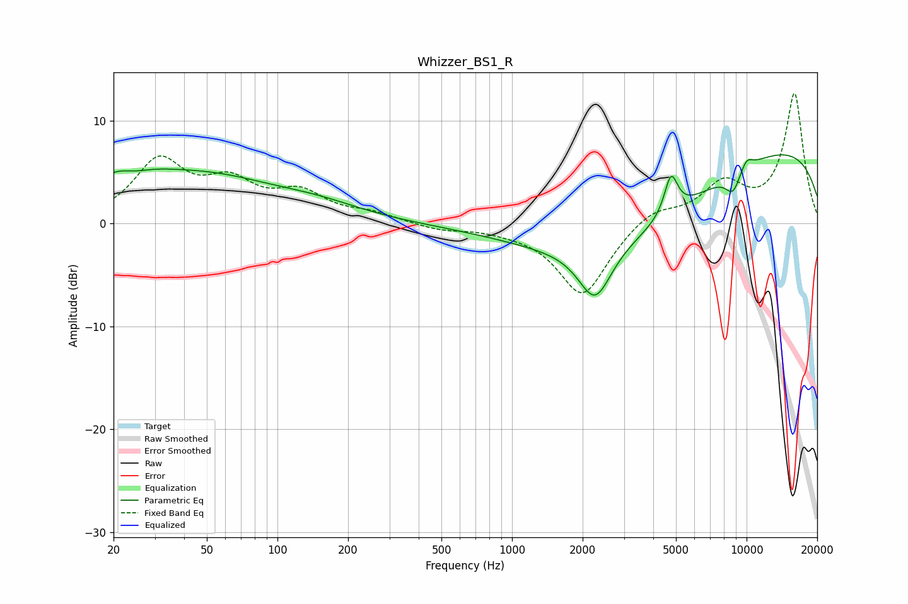

# Whizzer_BS1_R
See [usage instructions](https://github.com/jaakkopasanen/AutoEq#usage) for more options and info.

### Parametric EQs
Apply preamp of -6.8 dB when using parametric equalizer.

|   # | Type    |   Fc (Hz) |    Q |   Gain (dB) |
|-----|---------|-----------|------|-------------|
|   1 | Peaking |        22 | 1.1  |         4.4 |
|   2 | Peaking |        24 | 1.78 |        -1.9 |
|   3 | Peaking |        50 | 0.47 |         4.1 |
|   4 | Peaking |       152 | 0.73 |         1.1 |
|   5 | Peaking |      2260 | 2.03 |        -5.2 |
|   6 | Peaking |      3213 | 0.35 |        -6.5 |
|   7 | Peaking |      4762 | 4.93 |         3.8 |
|   8 | Peaking |      8750 | 4    |        -2   |
|   9 | Peaking |      9928 | 0.19 |         8.3 |
|  10 | Peaking |     10000 | 4.66 |         1.1 |

### Fixed Band EQs
When using fixed band (also called graphic) equalizer, apply preamp of **-12.7 dB** (if available) and set gains manually with these parameters.

|   # | Type    |   Fc (Hz) |    Q |   Gain (dB) |
|-----|---------|-----------|------|-------------|
|   1 | Peaking |        31 | 1.41 |         5.8 |
|   2 | Peaking |        62 | 1.41 |         3.4 |
|   3 | Peaking |       125 | 1.41 |         2.6 |
|   4 | Peaking |       250 | 1.41 |         0.8 |
|   5 | Peaking |       500 | 1.41 |        -0.6 |
|   6 | Peaking |      1000 | 1.41 |        -0.4 |
|   7 | Peaking |      2000 | 1.41 |        -7.1 |
|   8 | Peaking |      4000 | 1.41 |         1.5 |
|   9 | Peaking |      8000 | 1.41 |         3.6 |
|  10 | Peaking |     16000 | 1.41 |        12.6 |

### Graphs

