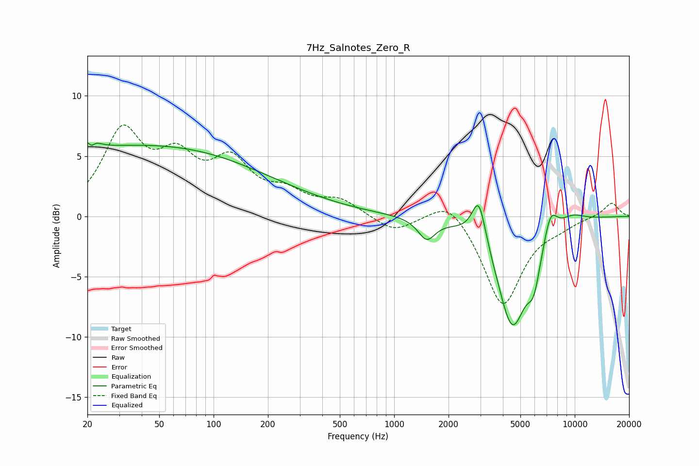

# 7Hz_Salnotes_Zero_R
See [usage instructions](https://github.com/jaakkopasanen/AutoEq#usage) for more options and info.

### Parametric EQs
Apply preamp of -6.2 dB when using parametric equalizer.

|   # | Type    |   Fc (Hz) |    Q |   Gain (dB) |
|-----|---------|-----------|------|-------------|
|   1 | Peaking |        21 | 4.8  |         3.8 |
|   2 | Peaking |        21 | 5.89 |        -3.3 |
|   3 | Peaking |        31 | 0.23 |         5.5 |
|   4 | Peaking |       177 | 0.41 |         1.5 |
|   5 | Peaking |      1513 | 3.02 |        -1.7 |
|   6 | Peaking |      2945 | 3.7  |         3.7 |
|   7 | Peaking |      4508 | 1.65 |        -9   |
|   8 | Peaking |      5943 | 3.83 |        -2.9 |
|   9 | Peaking |      7345 | 3.62 |         2.2 |
|  10 | Peaking |      9642 | 1.74 |         0.7 |

### Fixed Band EQs
When using fixed band (also called graphic) equalizer, apply preamp of **-7.7 dB** (if available) and set gains manually with these parameters.

|   # | Type    |   Fc (Hz) |    Q |   Gain (dB) |
|-----|---------|-----------|------|-------------|
|   1 | Peaking |        31 | 1.41 |         6.7 |
|   2 | Peaking |        62 | 1.41 |         4   |
|   3 | Peaking |       125 | 1.41 |         4   |
|   4 | Peaking |       250 | 1.41 |         1.6 |
|   5 | Peaking |       500 | 1.41 |         1.3 |
|   6 | Peaking |      1000 | 1.41 |        -1.3 |
|   7 | Peaking |      2000 | 1.41 |         1.8 |
|   8 | Peaking |      4000 | 1.41 |        -7.4 |
|   9 | Peaking |      8000 | 1.41 |        -0.6 |
|  10 | Peaking |     16000 | 1.41 |         1.2 |

### Graphs

