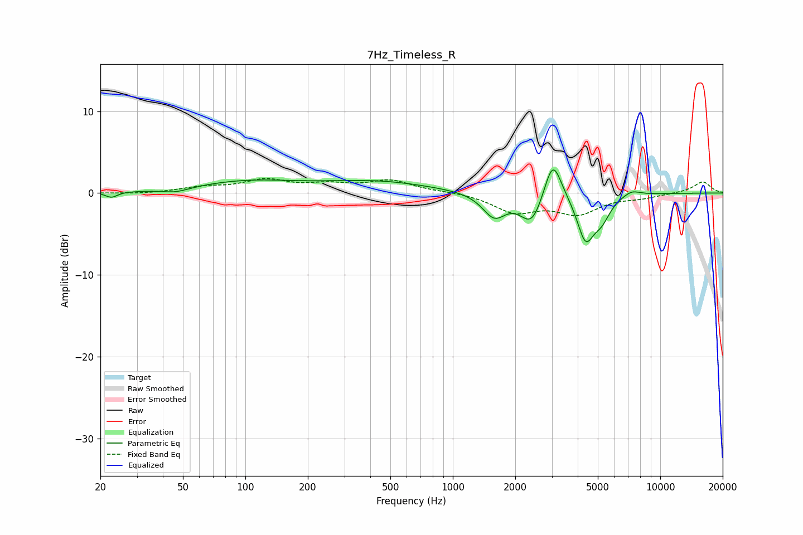

# 7Hz_Timeless_R
See [usage instructions](https://github.com/jaakkopasanen/AutoEq#usage) for more options and info.

### Parametric EQs
Apply preamp of -2.9 dB when using parametric equalizer.

|   # | Type    |   Fc (Hz) |    Q |   Gain (dB) |
|-----|---------|-----------|------|-------------|
|   1 | Peaking |        23 | 5.03 |        -0.7 |
|   2 | Peaking |        46 | 2.15 |        -0.5 |
|   3 | Peaking |       101 | 0.57 |         1.4 |
|   4 | Peaking |       432 | 0.54 |         1.3 |
|   5 | Peaking |      1584 | 2.53 |        -2.9 |
|   6 | Peaking |      2404 | 2.57 |        -3.8 |
|   7 | Peaking |      3033 | 3.36 |         5.3 |
|   8 | Peaking |      4365 | 3.4  |        -5.4 |
|   9 | Peaking |      5210 | 3.29 |        -2.4 |
|  10 | Peaking |      7277 | 3.18 |         0.7 |

### Fixed Band EQs
When using fixed band (also called graphic) equalizer, apply preamp of **-1.9 dB** (if available) and set gains manually with these parameters.

|   # | Type    |   Fc (Hz) |    Q |   Gain (dB) |
|-----|---------|-----------|------|-------------|
|   1 | Peaking |        31 | 1.41 |        -0.1 |
|   2 | Peaking |        62 | 1.41 |         0.6 |
|   3 | Peaking |       125 | 1.41 |         1.5 |
|   4 | Peaking |       250 | 1.41 |         0.9 |
|   5 | Peaking |       500 | 1.41 |         1.5 |
|   6 | Peaking |      1000 | 1.41 |         0.2 |
|   7 | Peaking |      2000 | 1.41 |        -2.2 |
|   8 | Peaking |      4000 | 1.41 |        -2.3 |
|   9 | Peaking |      8000 | 1.41 |        -0.5 |
|  10 | Peaking |     16000 | 1.41 |         1.4 |

### Graphs

