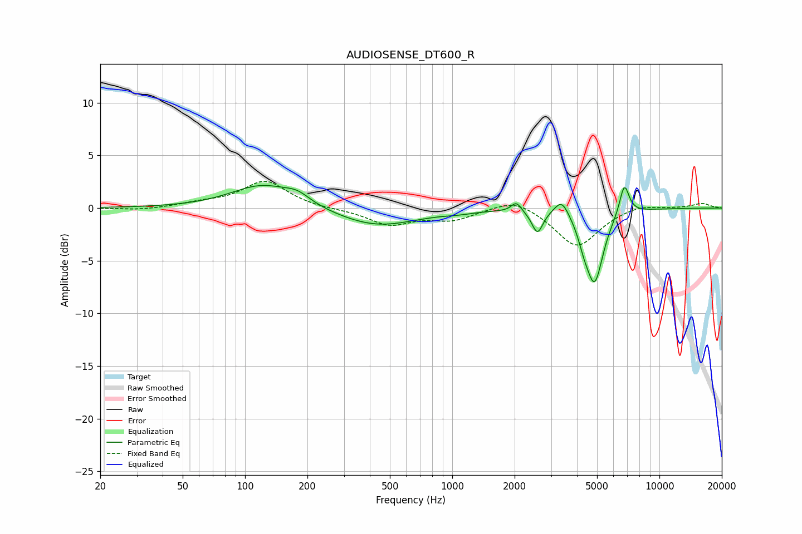

# AUDIOSENSE_DT600_R
See [usage instructions](https://github.com/jaakkopasanen/AutoEq#usage) for more options and info.

### Parametric EQs
Apply preamp of -2.2 dB when using parametric equalizer.

|   # | Type    |   Fc (Hz) |    Q |   Gain (dB) |
|-----|---------|-----------|------|-------------|
|   1 | Peaking |       122 | 0.94 |         2.2 |
|   2 | Peaking |       179 | 2.32 |         0.8 |
|   3 | Peaking |       431 | 0.72 |        -1.8 |
|   4 | Peaking |      1068 | 2.32 |        -0.2 |
|   5 | Peaking |      2038 | 5.99 |         0.9 |
|   6 | Peaking |      2577 | 5.44 |        -2.2 |
|   7 | Peaking |      3376 | 4.09 |         1.6 |
|   8 | Peaking |      4303 | 5.43 |        -1.1 |
|   9 | Peaking |      4860 | 3.3  |        -6.9 |
|  10 | Peaking |      6768 | 5.87 |         3   |

### Fixed Band EQs
When using fixed band (also called graphic) equalizer, apply preamp of **-2.6 dB** (if available) and set gains manually with these parameters.

|   # | Type    |   Fc (Hz) |    Q |   Gain (dB) |
|-----|---------|-----------|------|-------------|
|   1 | Peaking |        31 | 1.41 |        -0.2 |
|   2 | Peaking |        62 | 1.41 |         0.4 |
|   3 | Peaking |       125 | 1.41 |         2.5 |
|   4 | Peaking |       250 | 1.41 |        -0.1 |
|   5 | Peaking |       500 | 1.41 |        -1.5 |
|   6 | Peaking |      1000 | 1.41 |        -1   |
|   7 | Peaking |      2000 | 1.41 |         1.1 |
|   8 | Peaking |      4000 | 1.41 |        -3.7 |
|   9 | Peaking |      8000 | 1.41 |         0.4 |
|  10 | Peaking |     16000 | 1.41 |         0.5 |

### Graphs

