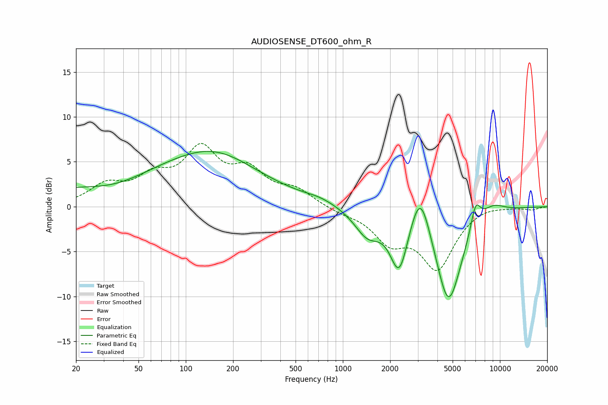

# AUDIOSENSE_DT600_ohm_R
See [usage instructions](https://github.com/jaakkopasanen/AutoEq#usage) for more options and info.

### Parametric EQs
Apply preamp of -6.3 dB when using parametric equalizer.

|   # | Type    |   Fc (Hz) |    Q |   Gain (dB) |
|-----|---------|-----------|------|-------------|
|   1 | Peaking |        35 | 0.6  |        -2.5 |
|   2 | Peaking |        67 | 0.21 |         5.2 |
|   3 | Peaking |       154 | 0.64 |         2   |
|   4 | Peaking |       714 | 1.46 |         0.4 |
|   5 | Peaking |      1432 | 1.7  |        -2.8 |
|   6 | Peaking |      2283 | 2.48 |        -6.4 |
|   7 | Peaking |      3112 | 2.25 |         5.6 |
|   8 | Peaking |      4703 | 1.59 |       -11   |
|   9 | Peaking |      7001 | 4.27 |         2.9 |
|  10 | Peaking |      8920 | 1.63 |         1.3 |

### Fixed Band EQs
When using fixed band (also called graphic) equalizer, apply preamp of **-7.1 dB** (if available) and set gains manually with these parameters.

|   # | Type    |   Fc (Hz) |    Q |   Gain (dB) |
|-----|---------|-----------|------|-------------|
|   1 | Peaking |        31 | 1.41 |         2.2 |
|   2 | Peaking |        62 | 1.41 |         2.7 |
|   3 | Peaking |       125 | 1.41 |         5.8 |
|   4 | Peaking |       250 | 1.41 |         3.4 |
|   5 | Peaking |       500 | 1.41 |         1.7 |
|   6 | Peaking |      1000 | 1.41 |        -0.5 |
|   7 | Peaking |      2000 | 1.41 |        -3.4 |
|   8 | Peaking |      4000 | 1.41 |        -6.5 |
|   9 | Peaking |      8000 | 1.41 |         0.3 |
|  10 | Peaking |     16000 | 1.41 |        -0.3 |

### Graphs

