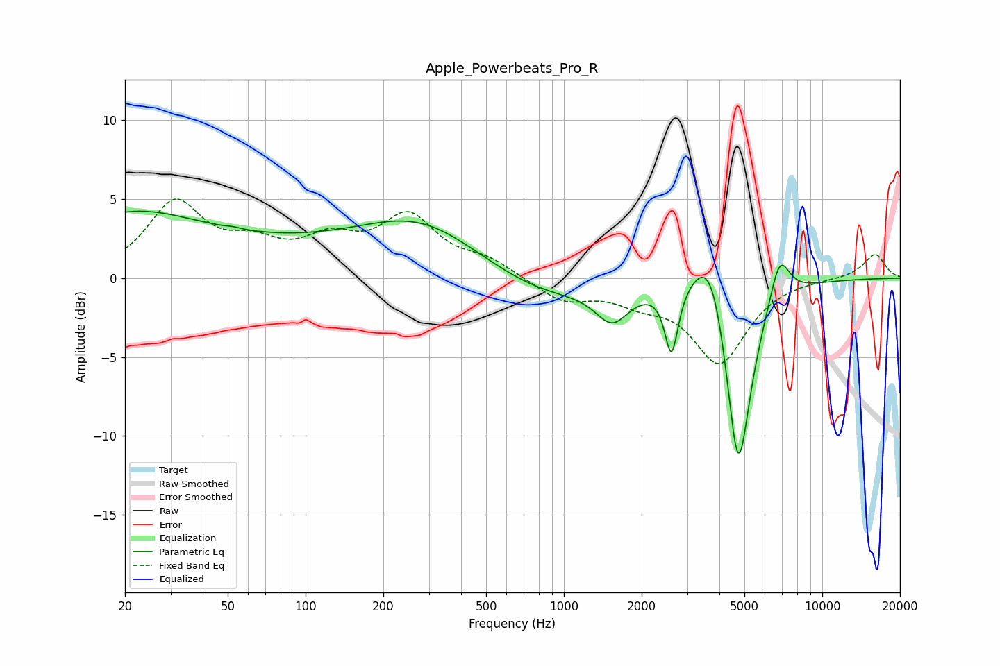

# Apple_Powerbeats_Pro_R
See [usage instructions](https://github.com/jaakkopasanen/AutoEq#usage) for more options and info.

### Parametric EQs
Apply preamp of -4.3 dB when using parametric equalizer.

|   # | Type    |   Fc (Hz) |    Q |   Gain (dB) |
|-----|---------|-----------|------|-------------|
|   1 | Peaking |        20 | 0.54 |         2.8 |
|   2 | Peaking |        53 | 5.42 |         0.1 |
|   3 | Peaking |        70 | 0.2  |         1.8 |
|   4 | Peaking |       284 | 0.62 |         2.6 |
|   5 | Peaking |       818 | 0.65 |        -1.4 |
|   6 | Peaking |      1539 | 2.18 |        -2.2 |
|   7 | Peaking |      2609 | 5.6  |        -4.3 |
|   8 | Peaking |      3725 | 2.01 |         4.7 |
|   9 | Peaking |      4728 | 2.63 |       -13.5 |
|  10 | Peaking |      6837 | 3.47 |         3   |

### Fixed Band EQs
When using fixed band (also called graphic) equalizer, apply preamp of **-5.1 dB** (if available) and set gains manually with these parameters.

|   # | Type    |   Fc (Hz) |    Q |   Gain (dB) |
|-----|---------|-----------|------|-------------|
|   1 | Peaking |        31 | 1.41 |         4.6 |
|   2 | Peaking |        62 | 1.41 |         1.6 |
|   3 | Peaking |       125 | 1.41 |         2   |
|   4 | Peaking |       250 | 1.41 |         3.6 |
|   5 | Peaking |       500 | 1.41 |         1   |
|   6 | Peaking |      1000 | 1.41 |        -1.4 |
|   7 | Peaking |      2000 | 1.41 |        -1.1 |
|   8 | Peaking |      4000 | 1.41 |        -5.2 |
|   9 | Peaking |      8000 | 1.41 |         0   |
|  10 | Peaking |     16000 | 1.41 |         1.6 |

### Graphs

