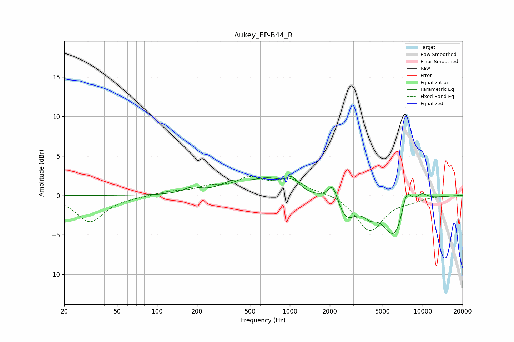

# Aukey_EP-B44_R
See [usage instructions](https://github.com/jaakkopasanen/AutoEq#usage) for more options and info.

### Parametric EQs
Apply preamp of -2.5 dB when using parametric equalizer.

|   # | Type    |   Fc (Hz) |    Q |   Gain (dB) |
|-----|---------|-----------|------|-------------|
|   1 | Peaking |       183 | 2.21 |         0.7 |
|   2 | Peaking |       373 | 1.45 |         1.3 |
|   3 | Peaking |       691 | 1.12 |         1.9 |
|   4 | Peaking |      1045 | 3.32 |         1.4 |
|   5 | Peaking |      2109 | 3.86 |         2.4 |
|   6 | Peaking |      2659 | 1.96 |        -2.7 |
|   7 | Peaking |      4014 | 3.02 |        -1.1 |
|   8 | Peaking |      6222 | 1.5  |        -5.6 |
|   9 | Peaking |      7532 | 3.31 |         3.6 |
|  10 | Peaking |      9819 | 2.53 |         1   |

### Fixed Band EQs
When using fixed band (also called graphic) equalizer, apply preamp of **-2.5 dB** (if available) and set gains manually with these parameters.

|   # | Type    |   Fc (Hz) |    Q |   Gain (dB) |
|-----|---------|-----------|------|-------------|
|   1 | Peaking |        31 | 1.41 |        -3.3 |
|   2 | Peaking |        62 | 1.41 |        -0.1 |
|   3 | Peaking |       125 | 1.41 |         0.4 |
|   4 | Peaking |       250 | 1.41 |         0.9 |
|   5 | Peaking |       500 | 1.41 |         1.9 |
|   6 | Peaking |      1000 | 1.41 |         1.9 |
|   7 | Peaking |      2000 | 1.41 |         0.3 |
|   8 | Peaking |      4000 | 1.41 |        -4.5 |
|   9 | Peaking |      8000 | 1.41 |        -0.5 |
|  10 | Peaking |     16000 | 1.41 |        -0   |

### Graphs

