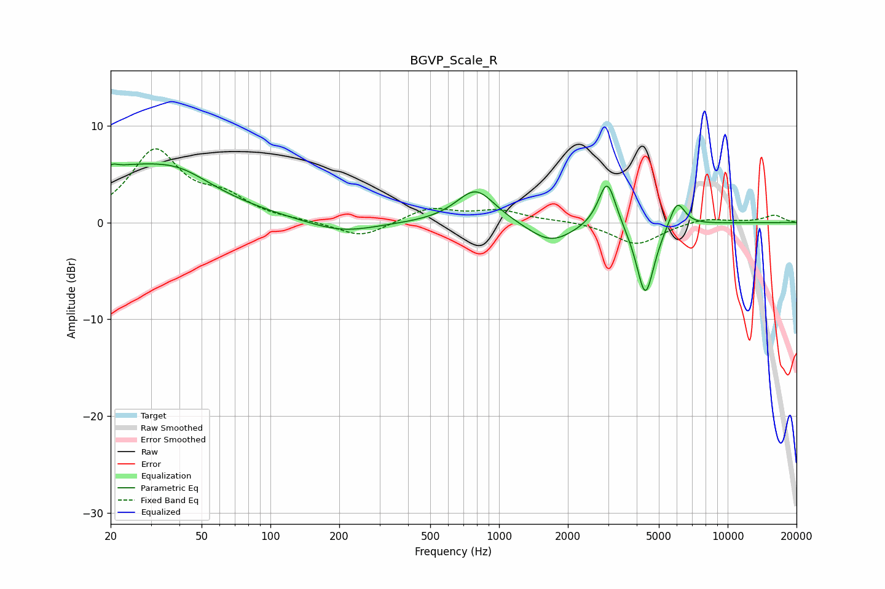

# BGVP_Scale_R
See [usage instructions](https://github.com/jaakkopasanen/AutoEq#usage) for more options and info.

### Parametric EQs
Apply preamp of -6.1 dB when using parametric equalizer.

|   # | Type    |   Fc (Hz) |    Q |   Gain (dB) |
|-----|---------|-----------|------|-------------|
|   1 | Peaking |        21 | 5.88 |         3.1 |
|   2 | Peaking |        21 | 5.73 |        -2.8 |
|   3 | Peaking |        24 | 0.43 |         5.4 |
|   4 | Peaking |        40 | 1.14 |         1.3 |
|   5 | Peaking |       205 | 0.95 |        -1.2 |
|   6 | Peaking |       791 | 1.67 |         3.5 |
|   7 | Peaking |      1682 | 1.44 |        -2.2 |
|   8 | Peaking |      2972 | 3.68 |         5   |
|   9 | Peaking |      4365 | 3.53 |        -7.7 |
|  10 | Peaking |      6008 | 4.01 |         2.8 |

### Fixed Band EQs
When using fixed band (also called graphic) equalizer, apply preamp of **-7.7 dB** (if available) and set gains manually with these parameters.

|   # | Type    |   Fc (Hz) |    Q |   Gain (dB) |
|-----|---------|-----------|------|-------------|
|   1 | Peaking |        31 | 1.41 |         7.2 |
|   2 | Peaking |        62 | 1.41 |         2.2 |
|   3 | Peaking |       125 | 1.41 |         0.1 |
|   4 | Peaking |       250 | 1.41 |        -1.6 |
|   5 | Peaking |       500 | 1.41 |         1.5 |
|   6 | Peaking |      1000 | 1.41 |         1.1 |
|   7 | Peaking |      2000 | 1.41 |         0.2 |
|   8 | Peaking |      4000 | 1.41 |        -2.3 |
|   9 | Peaking |      8000 | 1.41 |         0.5 |
|  10 | Peaking |     16000 | 1.41 |         0.7 |

### Graphs

