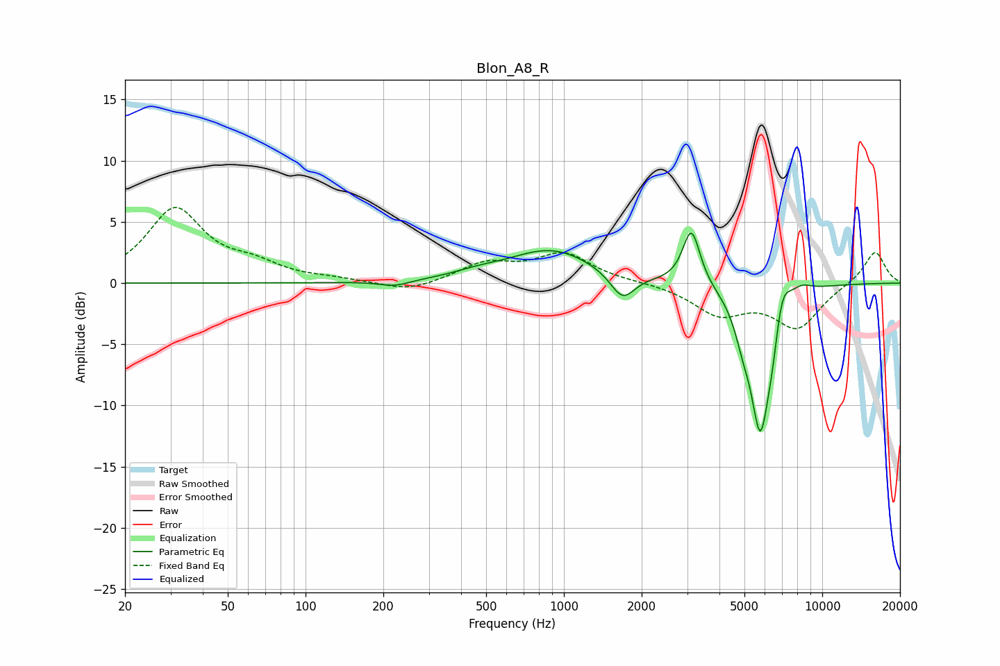

# Blon_A8_R
See [usage instructions](https://github.com/jaakkopasanen/AutoEq#usage) for more options and info.

### Parametric EQs
Apply preamp of -4.2 dB when using parametric equalizer.

|   # | Type    |   Fc (Hz) |    Q |   Gain (dB) |
|-----|---------|-----------|------|-------------|
|   1 | Peaking |       222 | 2.43 |        -0.5 |
|   2 | Peaking |       460 | 1.62 |         0.3 |
|   3 | Peaking |       892 | 0.84 |         2.7 |
|   4 | Peaking |      1686 | 3    |        -2.2 |
|   5 | Peaking |      3116 | 4.23 |         4.6 |
|   6 | Peaking |      4926 | 4.54 |        -1.7 |
|   7 | Peaking |      5761 | 3.34 |       -11.9 |
|   8 | Peaking |      6414 | 6    |        -1.7 |
|   9 | Peaking |      6985 | 4.47 |         2.7 |
|  10 | Peaking |      8252 | 3.05 |         0.8 |

### Fixed Band EQs
When using fixed band (also called graphic) equalizer, apply preamp of **-6.3 dB** (if available) and set gains manually with these parameters.

|   # | Type    |   Fc (Hz) |    Q |   Gain (dB) |
|-----|---------|-----------|------|-------------|
|   1 | Peaking |        31 | 1.41 |         6   |
|   2 | Peaking |        62 | 1.41 |         1.2 |
|   3 | Peaking |       125 | 1.41 |         0.2 |
|   4 | Peaking |       250 | 1.41 |        -0.8 |
|   5 | Peaking |       500 | 1.41 |         1.5 |
|   6 | Peaking |      1000 | 1.41 |         2.3 |
|   7 | Peaking |      2000 | 1.41 |         0.1 |
|   8 | Peaking |      4000 | 1.41 |        -2.4 |
|   9 | Peaking |      8000 | 1.41 |        -3.5 |
|  10 | Peaking |     16000 | 1.41 |         2.7 |

### Graphs

