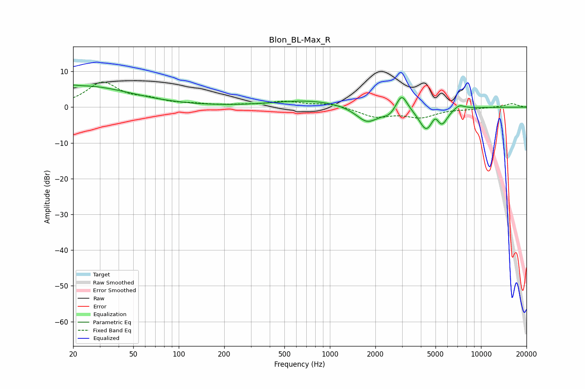

# Blon_BL-Max_R
See [usage instructions](https://github.com/jaakkopasanen/AutoEq#usage) for more options and info.

### Parametric EQs
Apply preamp of -6.3 dB when using parametric equalizer.

|   # | Type    |   Fc (Hz) |    Q |   Gain (dB) |
|-----|---------|-----------|------|-------------|
|   1 | Peaking |        20 | 6    |         0.4 |
|   2 | Peaking |        23 | 0.44 |         5.9 |
|   3 | Peaking |       736 | 0.59 |         1.9 |
|   4 | Peaking |      1765 | 1.89 |        -4.5 |
|   5 | Peaking |      2483 | 3    |        -1.8 |
|   6 | Peaking |      2983 | 3.8  |         5   |
|   7 | Peaking |      4331 | 3    |        -6   |
|   8 | Peaking |      4986 | 5.64 |         2.2 |
|   9 | Peaking |      5504 | 3.71 |        -4.1 |
|  10 | Peaking |      7167 | 3.8  |         1.3 |

### Fixed Band EQs
When using fixed band (also called graphic) equalizer, apply preamp of **-7.1 dB** (if available) and set gains manually with these parameters.

|   # | Type    |   Fc (Hz) |    Q |   Gain (dB) |
|-----|---------|-----------|------|-------------|
|   1 | Peaking |        31 | 1.41 |         6.7 |
|   2 | Peaking |        62 | 1.41 |         1.6 |
|   3 | Peaking |       125 | 1.41 |         0.6 |
|   4 | Peaking |       250 | 1.41 |         0.4 |
|   5 | Peaking |       500 | 1.41 |         1.5 |
|   6 | Peaking |      1000 | 1.41 |         1   |
|   7 | Peaking |      2000 | 1.41 |        -2.6 |
|   8 | Peaking |      4000 | 1.41 |        -2.6 |
|   9 | Peaking |      8000 | 1.41 |        -0.4 |
|  10 | Peaking |     16000 | 1.41 |         1   |

### Graphs

