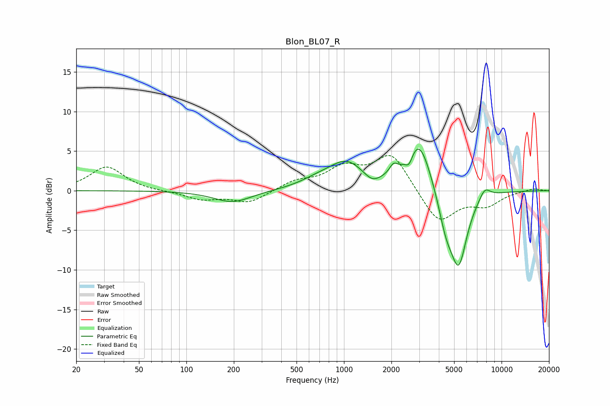

# Blon_BL07_R
See [usage instructions](https://github.com/jaakkopasanen/AutoEq#usage) for more options and info.

### Parametric EQs
Apply preamp of -5.3 dB when using parametric equalizer.

|   # | Type    |   Fc (Hz) |    Q |   Gain (dB) |
|-----|---------|-----------|------|-------------|
|   1 | Peaking |       197 | 1.19 |        -1.5 |
|   2 | Peaking |       678 | 1.23 |         0.8 |
|   3 | Peaking |      1040 | 1.26 |         3.3 |
|   4 | Peaking |      1508 | 2.73 |        -1   |
|   5 | Peaking |      2060 | 5.52 |         1.1 |
|   6 | Peaking |      2590 | 6    |        -1.5 |
|   7 | Peaking |      2983 | 1.77 |         6.7 |
|   8 | Peaking |      4435 | 2.8  |        -3.9 |
|   9 | Peaking |      5349 | 2.53 |        -9   |
|  10 | Peaking |      7816 | 3.69 |         1.4 |

### Fixed Band EQs
When using fixed band (also called graphic) equalizer, apply preamp of **-4.5 dB** (if available) and set gains manually with these parameters.

|   # | Type    |   Fc (Hz) |    Q |   Gain (dB) |
|-----|---------|-----------|------|-------------|
|   1 | Peaking |        31 | 1.41 |         3   |
|   2 | Peaking |        62 | 1.41 |        -0.1 |
|   3 | Peaking |       125 | 1.41 |        -1.1 |
|   4 | Peaking |       250 | 1.41 |        -1.5 |
|   5 | Peaking |       500 | 1.41 |         1.1 |
|   6 | Peaking |      1000 | 1.41 |         2.6 |
|   7 | Peaking |      2000 | 1.41 |         4.6 |
|   8 | Peaking |      4000 | 1.41 |        -4.2 |
|   9 | Peaking |      8000 | 1.41 |        -1.7 |
|  10 | Peaking |     16000 | 1.41 |         0.3 |

### Graphs

