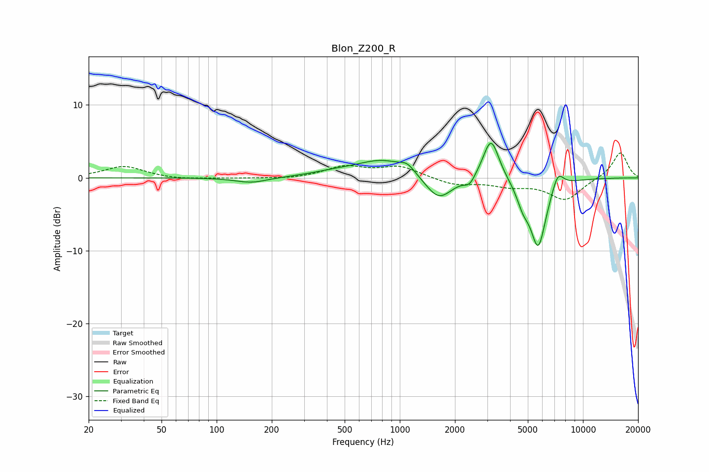

# Blon_Z200_R
See [usage instructions](https://github.com/jaakkopasanen/AutoEq#usage) for more options and info.

### Parametric EQs
Apply preamp of -4.8 dB when using parametric equalizer.

|   # | Type    |   Fc (Hz) |    Q |   Gain (dB) |
|-----|---------|-----------|------|-------------|
|   1 | Peaking |       155 | 1.62 |        -0.7 |
|   2 | Peaking |       439 | 1.11 |         0.5 |
|   3 | Peaking |       810 | 1    |         2.4 |
|   4 | Peaking |      1101 | 3.52 |         1   |
|   5 | Peaking |      1632 | 1.92 |        -3.4 |
|   6 | Peaking |      2404 | 4.72 |        -1.2 |
|   7 | Peaking |      3149 | 3.21 |         5.8 |
|   8 | Peaking |      4703 | 4.04 |        -2.2 |
|   9 | Peaking |      5699 | 3.08 |        -9.3 |
|  10 | Peaking |      7287 | 4.24 |         2.5 |

### Fixed Band EQs
When using fixed band (also called graphic) equalizer, apply preamp of **-3.5 dB** (if available) and set gains manually with these parameters.

|   # | Type    |   Fc (Hz) |    Q |   Gain (dB) |
|-----|---------|-----------|------|-------------|
|   1 | Peaking |        31 | 1.41 |         1.6 |
|   2 | Peaking |        62 | 1.41 |        -0.2 |
|   3 | Peaking |       125 | 1.41 |        -0.1 |
|   4 | Peaking |       250 | 1.41 |        -0.2 |
|   5 | Peaking |       500 | 1.41 |         1.5 |
|   6 | Peaking |      1000 | 1.41 |         1.5 |
|   7 | Peaking |      2000 | 1.41 |        -1   |
|   8 | Peaking |      4000 | 1.41 |        -1   |
|   9 | Peaking |      8000 | 1.41 |        -3   |
|  10 | Peaking |     16000 | 1.41 |         3.6 |

### Graphs

