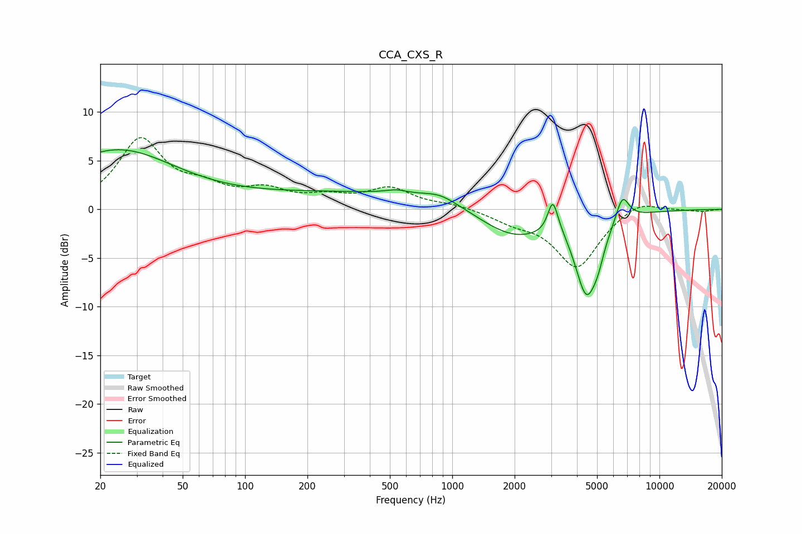

# CCA_CXS_R
See [usage instructions](https://github.com/jaakkopasanen/AutoEq#usage) for more options and info.

### Parametric EQs
Apply preamp of -6.2 dB when using parametric equalizer.

|   # | Type    |   Fc (Hz) |    Q |   Gain (dB) |
|-----|---------|-----------|------|-------------|
|   1 | Peaking |        24 | 0.49 |         6   |
|   2 | Peaking |       493 | 0.18 |         1.8 |
|   3 | Peaking |       539 | 2.63 |         0.4 |
|   4 | Peaking |       872 | 1.68 |         0.9 |
|   5 | Peaking |      1974 | 0.77 |        -3.6 |
|   6 | Peaking |      3056 | 5.98 |         3.2 |
|   7 | Peaking |      3331 | 2.8  |         0.8 |
|   8 | Peaking |      4450 | 2.48 |        -8.1 |
|   9 | Peaking |      5059 | 4.94 |        -1.4 |
|  10 | Peaking |      6627 | 4.26 |         2.7 |

### Fixed Band EQs
When using fixed band (also called graphic) equalizer, apply preamp of **-7.5 dB** (if available) and set gains manually with these parameters.

|   # | Type    |   Fc (Hz) |    Q |   Gain (dB) |
|-----|---------|-----------|------|-------------|
|   1 | Peaking |        31 | 1.41 |         7   |
|   2 | Peaking |        62 | 1.41 |         1.7 |
|   3 | Peaking |       125 | 1.41 |         1.7 |
|   4 | Peaking |       250 | 1.41 |         1   |
|   5 | Peaking |       500 | 1.41 |         2   |
|   6 | Peaking |      1000 | 1.41 |         0.5 |
|   7 | Peaking |      2000 | 1.41 |        -1   |
|   8 | Peaking |      4000 | 1.41 |        -5.9 |
|   9 | Peaking |      8000 | 1.41 |         1.1 |
|  10 | Peaking |     16000 | 1.41 |        -0.2 |

### Graphs

