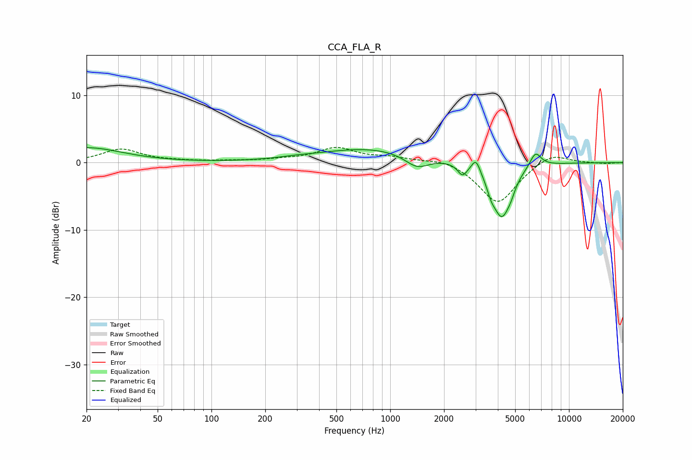

# CCA_FLA_R
See [usage instructions](https://github.com/jaakkopasanen/AutoEq#usage) for more options and info.

### Parametric EQs
Apply preamp of -2.3 dB when using parametric equalizer.

|   # | Type    |   Fc (Hz) |    Q |   Gain (dB) |
|-----|---------|-----------|------|-------------|
|   1 | Peaking |        20 | 0.72 |         2.2 |
|   2 | Peaking |       296 | 1.72 |         0.2 |
|   3 | Peaking |       783 | 0.48 |         2.1 |
|   4 | Peaking |      1412 | 2.04 |        -1.9 |
|   5 | Peaking |      2536 | 5.36 |        -1.7 |
|   6 | Peaking |      3018 | 6    |         2   |
|   7 | Peaking |      3669 | 6    |        -1.4 |
|   8 | Peaking |      4206 | 2.66 |        -7.8 |
|   9 | Peaking |      4734 | 5.99 |        -0.8 |
|  10 | Peaking |      6495 | 4.32 |         2.3 |

### Fixed Band EQs
When using fixed band (also called graphic) equalizer, apply preamp of **-2.4 dB** (if available) and set gains manually with these parameters.

|   # | Type    |   Fc (Hz) |    Q |   Gain (dB) |
|-----|---------|-----------|------|-------------|
|   1 | Peaking |        31 | 1.41 |         2   |
|   2 | Peaking |        62 | 1.41 |         0.1 |
|   3 | Peaking |       125 | 1.41 |         0.2 |
|   4 | Peaking |       250 | 1.41 |         0.3 |
|   5 | Peaking |       500 | 1.41 |         2.1 |
|   6 | Peaking |      1000 | 1.41 |         0.7 |
|   7 | Peaking |      2000 | 1.41 |         0.7 |
|   8 | Peaking |      4000 | 1.41 |        -6.1 |
|   9 | Peaking |      8000 | 1.41 |         1.6 |
|  10 | Peaking |     16000 | 1.41 |        -0.1 |

### Graphs

