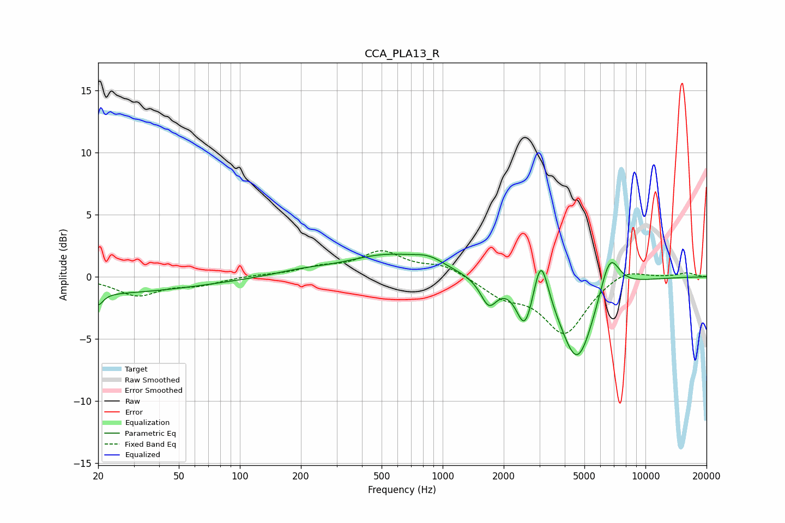

# CCA_PLA13_R
See [usage instructions](https://github.com/jaakkopasanen/AutoEq#usage) for more options and info.

### Parametric EQs
Apply preamp of -1.9 dB when using parametric equalizer.

|   # | Type    |   Fc (Hz) |    Q |   Gain (dB) |
|-----|---------|-----------|------|-------------|
|   1 | Peaking |        20 | 5.89 |        -1   |
|   2 | Peaking |        20 | 0.29 |        -1.3 |
|   3 | Peaking |       201 | 1.09 |         0.3 |
|   4 | Peaking |       532 | 0.69 |         1.7 |
|   5 | Peaking |       860 | 1.88 |         0.7 |
|   6 | Peaking |      1687 | 3.51 |        -2.1 |
|   7 | Peaking |      2542 | 3.54 |        -3.4 |
|   8 | Peaking |      3051 | 4.09 |         3.8 |
|   9 | Peaking |      4611 | 1.66 |        -6.9 |
|  10 | Peaking |      6660 | 2.81 |         3.4 |

### Fixed Band EQs
When using fixed band (also called graphic) equalizer, apply preamp of **-2.2 dB** (if available) and set gains manually with these parameters.

|   # | Type    |   Fc (Hz) |    Q |   Gain (dB) |
|-----|---------|-----------|------|-------------|
|   1 | Peaking |        31 | 1.41 |        -1.5 |
|   2 | Peaking |        62 | 1.41 |        -0.6 |
|   3 | Peaking |       125 | 1.41 |         0.1 |
|   4 | Peaking |       250 | 1.41 |         0.6 |
|   5 | Peaking |       500 | 1.41 |         1.9 |
|   6 | Peaking |      1000 | 1.41 |         0.9 |
|   7 | Peaking |      2000 | 1.41 |        -1.4 |
|   8 | Peaking |      4000 | 1.41 |        -4.5 |
|   9 | Peaking |      8000 | 1.41 |         0.8 |
|  10 | Peaking |     16000 | 1.41 |         0.3 |

### Graphs

