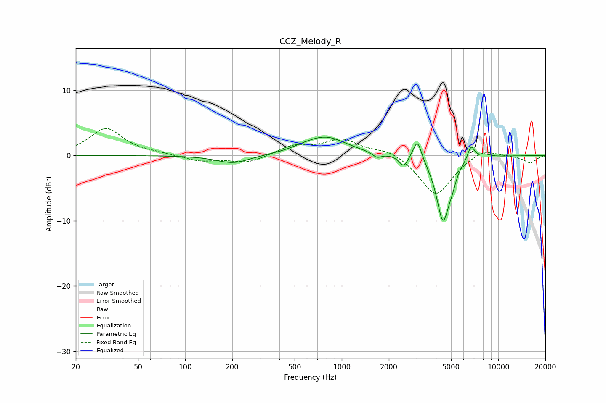

# CCZ_Melody_R
See [usage instructions](https://github.com/jaakkopasanen/AutoEq#usage) for more options and info.

### Parametric EQs
Apply preamp of -2.9 dB when using parametric equalizer.

|   # | Type    |   Fc (Hz) |    Q |   Gain (dB) |
|-----|---------|-----------|------|-------------|
|   1 | Peaking |       203 | 1.34 |        -1.3 |
|   2 | Peaking |       563 | 1.94 |         0.2 |
|   3 | Peaking |       787 | 1.05 |         2.8 |
|   4 | Peaking |      1678 | 5.09 |        -0.7 |
|   5 | Peaking |      2487 | 5.28 |        -1.7 |
|   6 | Peaking |      3046 | 5.2  |         3.3 |
|   7 | Peaking |      4436 | 3.31 |        -9.9 |
|   8 | Peaking |      5068 | 6    |        -1.3 |
|   9 | Peaking |      6706 | 6    |         2.2 |
|  10 | Peaking |      8205 | 3.79 |         0.5 |

### Fixed Band EQs
When using fixed band (also called graphic) equalizer, apply preamp of **-4.2 dB** (if available) and set gains manually with these parameters.

|   # | Type    |   Fc (Hz) |    Q |   Gain (dB) |
|-----|---------|-----------|------|-------------|
|   1 | Peaking |        31 | 1.41 |         4.1 |
|   2 | Peaking |        62 | 1.41 |         0.2 |
|   3 | Peaking |       125 | 1.41 |        -0.9 |
|   4 | Peaking |       250 | 1.41 |        -1.2 |
|   5 | Peaking |       500 | 1.41 |         1.4 |
|   6 | Peaking |      1000 | 1.41 |         2.4 |
|   7 | Peaking |      2000 | 1.41 |         1   |
|   8 | Peaking |      4000 | 1.41 |        -6.2 |
|   9 | Peaking |      8000 | 1.41 |         1.3 |
|  10 | Peaking |     16000 | 1.41 |        -1.1 |

### Graphs

