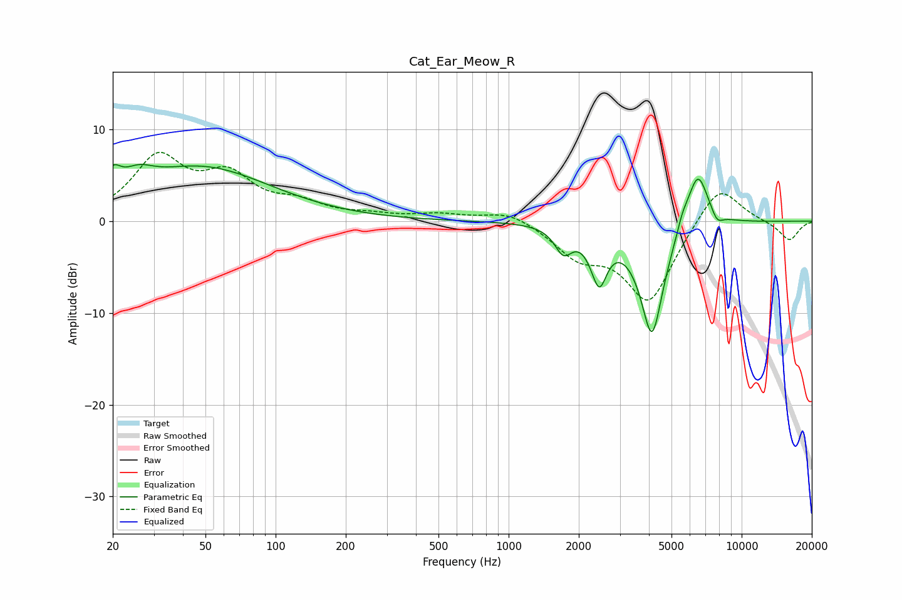

# Cat_Ear_Meow_R
See [usage instructions](https://github.com/jaakkopasanen/AutoEq#usage) for more options and info.

### Parametric EQs
Apply preamp of -6.3 dB when using parametric equalizer.

|   # | Type    |   Fc (Hz) |    Q |   Gain (dB) |
|-----|---------|-----------|------|-------------|
|   1 | Peaking |        20 | 4.2  |         2.3 |
|   2 | Peaking |        26 | 2.19 |         1.7 |
|   3 | Peaking |        48 | 0.48 |         5.8 |
|   4 | Peaking |      1718 | 3.81 |        -2.7 |
|   5 | Peaking |      2401 | 5.96 |         1.5 |
|   6 | Peaking |      2430 | 4.31 |        -7   |
|   7 | Peaking |      4123 | 2.71 |       -12.4 |
|   8 | Peaking |      5564 | 5.37 |         1.3 |
|   9 | Peaking |      6479 | 2.96 |         6.2 |
|  10 | Peaking |      7842 | 5.38 |        -1.2 |

### Fixed Band EQs
When using fixed band (also called graphic) equalizer, apply preamp of **-7.6 dB** (if available) and set gains manually with these parameters.

|   # | Type    |   Fc (Hz) |    Q |   Gain (dB) |
|-----|---------|-----------|------|-------------|
|   1 | Peaking |        31 | 1.41 |         6.6 |
|   2 | Peaking |        62 | 1.41 |         4.3 |
|   3 | Peaking |       125 | 1.41 |         1.6 |
|   4 | Peaking |       250 | 1.41 |         0.5 |
|   5 | Peaking |       500 | 1.41 |         0.7 |
|   6 | Peaking |      1000 | 1.41 |         1.2 |
|   7 | Peaking |      2000 | 1.41 |        -3.3 |
|   8 | Peaking |      4000 | 1.41 |        -8.7 |
|   9 | Peaking |      8000 | 1.41 |         4.5 |
|  10 | Peaking |     16000 | 1.41 |        -2.1 |

### Graphs

