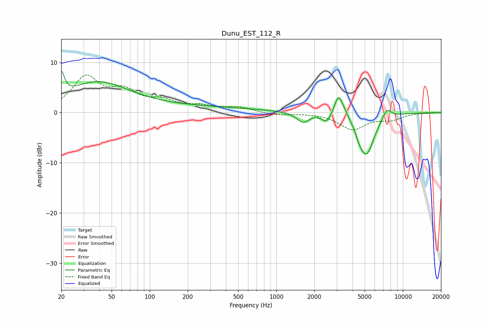

# Dunu_EST_112_R
See [usage instructions](https://github.com/jaakkopasanen/AutoEq#usage) for more options and info.

### Parametric EQs
Apply preamp of -8.4 dB when using parametric equalizer.

|   # | Type    |   Fc (Hz) |    Q |   Gain (dB) |
|-----|---------|-----------|------|-------------|
|   1 | Peaking |        20 | 6    |         4.6 |
|   2 | Peaking |        38 | 0.58 |         5.3 |
|   3 | Peaking |       150 | 0.19 |         1.1 |
|   4 | Peaking |      1624 | 2.93 |        -2   |
|   5 | Peaking |      2499 | 3.94 |        -1.9 |
|   6 | Peaking |      3103 | 4.25 |         4.2 |
|   7 | Peaking |      3481 | 3.45 |         0.8 |
|   8 | Peaking |      4533 | 4.67 |        -1.5 |
|   9 | Peaking |      5174 | 2.3  |        -8.1 |
|  10 | Peaking |      7473 | 3.91 |         2.1 |

### Fixed Band EQs
When using fixed band (also called graphic) equalizer, apply preamp of **-7.6 dB** (if available) and set gains manually with these parameters.

|   # | Type    |   Fc (Hz) |    Q |   Gain (dB) |
|-----|---------|-----------|------|-------------|
|   1 | Peaking |        31 | 1.41 |         6.7 |
|   2 | Peaking |        62 | 1.41 |         3.6 |
|   3 | Peaking |       125 | 1.41 |         1.9 |
|   4 | Peaking |       250 | 1.41 |         1   |
|   5 | Peaking |       500 | 1.41 |         1   |
|   6 | Peaking |      1000 | 1.41 |        -0.5 |
|   7 | Peaking |      2000 | 1.41 |        -0   |
|   8 | Peaking |      4000 | 1.41 |        -3.2 |
|   9 | Peaking |      8000 | 1.41 |        -1.2 |
|  10 | Peaking |     16000 | 1.41 |        -0.1 |

### Graphs

