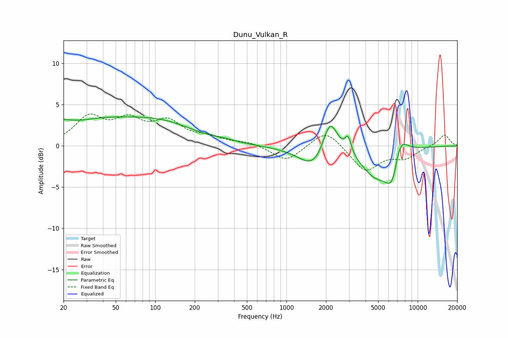

# Dunu_Vulkan_R
See [usage instructions](https://github.com/jaakkopasanen/AutoEq#usage) for more options and info.

### Parametric EQs
Apply preamp of -3.6 dB when using parametric equalizer.

|   # | Type    |   Fc (Hz) |    Q |   Gain (dB) |
|-----|---------|-----------|------|-------------|
|   1 | Peaking |        25 | 0.23 |         3.4 |
|   2 | Peaking |        27 | 1.44 |        -0.4 |
|   3 | Peaking |       124 | 0.59 |         1.5 |
|   4 | Peaking |       342 | 1.94 |         0.2 |
|   5 | Peaking |      1697 | 1.23 |        -3.3 |
|   6 | Peaking |      2141 | 2.28 |         5.2 |
|   7 | Peaking |      2953 | 5.95 |         1.9 |
|   8 | Peaking |      4792 | 1.2  |        -3.4 |
|   9 | Peaking |      6449 | 2.52 |        -5   |
|  10 | Peaking |      7186 | 2.26 |         4.2 |

### Fixed Band EQs
When using fixed band (also called graphic) equalizer, apply preamp of **-4.0 dB** (if available) and set gains manually with these parameters.

|   # | Type    |   Fc (Hz) |    Q |   Gain (dB) |
|-----|---------|-----------|------|-------------|
|   1 | Peaking |        31 | 1.41 |         3.3 |
|   2 | Peaking |        62 | 1.41 |         2.7 |
|   3 | Peaking |       125 | 1.41 |         2.6 |
|   4 | Peaking |       250 | 1.41 |         0.8 |
|   5 | Peaking |       500 | 1.41 |         0.4 |
|   6 | Peaking |      1000 | 1.41 |        -1.9 |
|   7 | Peaking |      2000 | 1.41 |         2.1 |
|   8 | Peaking |      4000 | 1.41 |        -3.1 |
|   9 | Peaking |      8000 | 1.41 |        -1.3 |
|  10 | Peaking |     16000 | 1.41 |         1.4 |

### Graphs

