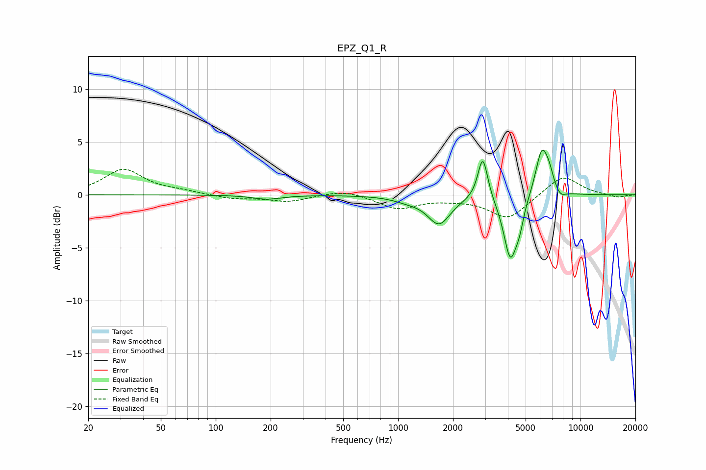

# EPZ_Q1_R
See [usage instructions](https://github.com/jaakkopasanen/AutoEq#usage) for more options and info.

### Parametric EQs
Apply preamp of -4.3 dB when using parametric equalizer.

|   # | Type    |   Fc (Hz) |    Q |   Gain (dB) |
|-----|---------|-----------|------|-------------|
|   1 | Peaking |       191 | 1.8  |        -0.4 |
|   2 | Peaking |      1126 | 1.82 |        -0.4 |
|   3 | Peaking |      1676 | 2.28 |        -2.7 |
|   4 | Peaking |      2913 | 5.18 |         3.7 |
|   5 | Peaking |      2914 | 6    |         0.4 |
|   6 | Peaking |      4126 | 3.78 |        -5.9 |
|   7 | Peaking |      4630 | 6    |        -1.5 |
|   8 | Peaking |      6149 | 3.9  |         4.5 |
|   9 | Peaking |      6760 | 6    |         1   |
|  10 | Peaking |      7748 | 4.74 |        -0.6 |

### Fixed Band EQs
When using fixed band (also called graphic) equalizer, apply preamp of **-2.5 dB** (if available) and set gains manually with these parameters.

|   # | Type    |   Fc (Hz) |    Q |   Gain (dB) |
|-----|---------|-----------|------|-------------|
|   1 | Peaking |        31 | 1.41 |         2.4 |
|   2 | Peaking |        62 | 1.41 |         0.3 |
|   3 | Peaking |       125 | 1.41 |        -0.4 |
|   4 | Peaking |       250 | 1.41 |        -0.6 |
|   5 | Peaking |       500 | 1.41 |         0.5 |
|   6 | Peaking |      1000 | 1.41 |        -1.3 |
|   7 | Peaking |      2000 | 1.41 |        -0.2 |
|   8 | Peaking |      4000 | 1.41 |        -2.3 |
|   9 | Peaking |      8000 | 1.41 |         1.9 |
|  10 | Peaking |     16000 | 1.41 |        -0.3 |

### Graphs

