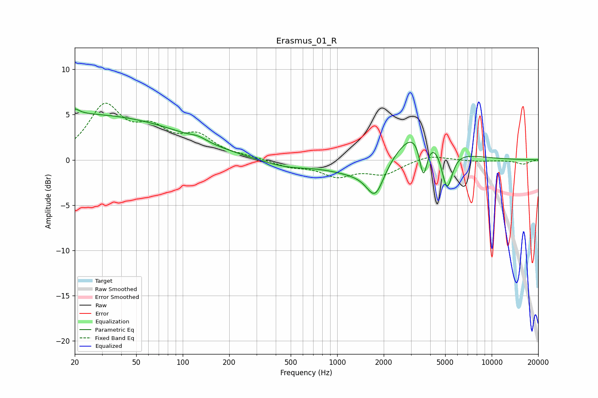

# Erasmus_01_R
See [usage instructions](https://github.com/jaakkopasanen/AutoEq#usage) for more options and info.

### Parametric EQs
Apply preamp of -5.7 dB when using parametric equalizer.

|   # | Type    |   Fc (Hz) |    Q |   Gain (dB) |
|-----|---------|-----------|------|-------------|
|   1 | Peaking |        20 | 5.47 |         3.2 |
|   2 | Peaking |        20 | 5.69 |        -2.6 |
|   3 | Peaking |        21 | 0.19 |         5   |
|   4 | Peaking |       126 | 2.74 |         0.4 |
|   5 | Peaking |       463 | 0.86 |        -0.8 |
|   6 | Peaking |      1390 | 0.76 |        -1.6 |
|   7 | Peaking |      1765 | 2.52 |        -3.5 |
|   8 | Peaking |      3443 | 1.02 |         4.4 |
|   9 | Peaking |      3614 | 5.37 |        -4.7 |
|  10 | Peaking |      5132 | 3.95 |        -4.8 |

### Fixed Band EQs
When using fixed band (also called graphic) equalizer, apply preamp of **-6.4 dB** (if available) and set gains manually with these parameters.

|   # | Type    |   Fc (Hz) |    Q |   Gain (dB) |
|-----|---------|-----------|------|-------------|
|   1 | Peaking |        31 | 1.41 |         5.7 |
|   2 | Peaking |        62 | 1.41 |         2.8 |
|   3 | Peaking |       125 | 1.41 |         2.3 |
|   4 | Peaking |       250 | 1.41 |         0.2 |
|   5 | Peaking |       500 | 1.41 |        -0.7 |
|   6 | Peaking |      1000 | 1.41 |        -1.6 |
|   7 | Peaking |      2000 | 1.41 |        -1.5 |
|   8 | Peaking |      4000 | 1.41 |         0.6 |
|   9 | Peaking |      8000 | 1.41 |        -0.2 |
|  10 | Peaking |     16000 | 1.41 |        -0.5 |

### Graphs

